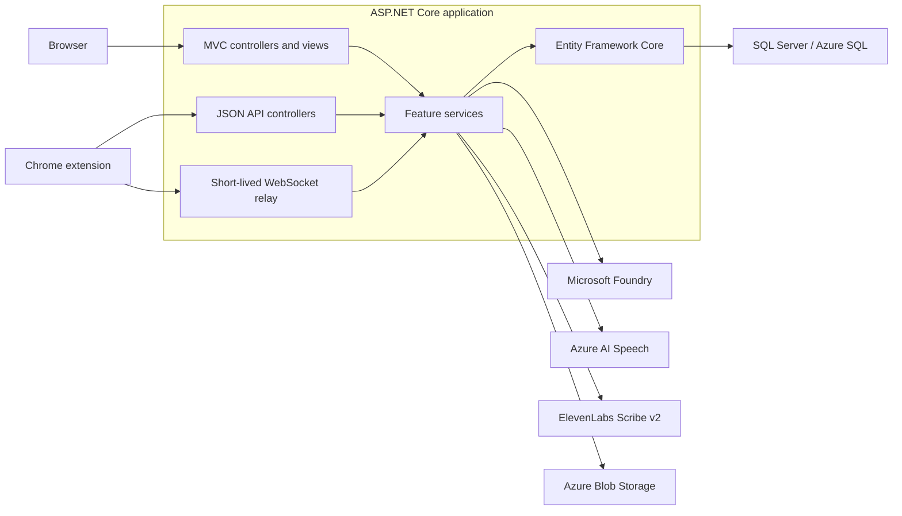

# Glosify

[](https://github.com/gusbo9233/Glosify-.net/actions/workflows/master_glosify.yml)
[](https://dotnet.microsoft.com/)
[](LICENSE)

**[Try the live app](https://glosify.se)** · [Portfolio case study](docs/portfolio-case-study.md) · [Architecture guide](docs/ARCHITECTURE.md) · [Architecture decisions](docs/adr/) · [Automated tests](Glosify.Tests/)

Glosify is a language-learning app built with ASP.NET Core MVC. It combines
vocabulary and sentence quizzes with flashcards, typing practice, speaking
exercises, shared collections, PDF reading, and AI-assisted content creation.

I built Glosify to learn how the parts of a complete .NET web application fit
together. It started as a school project and grew into a portfolio project with
a real database, authentication, automated tests, Azure services, and a live
deployment.

## What this project includes

- A working ASP.NET Core 10 MVC application with several connected features.
- A Manifest V3 Chrome extension that connects to the same account and APIs to
  turn Chrome tab audio into live translated subtitles.
- SQL Server development and Azure SQL production databases managed with reviewed EF Core migrations.
- ASP.NET Core Identity, external sign-in, ownership checks, rate limits, and consistent Problem Details errors.
- Unit, integration, contract, JavaScript, and Playwright browser tests in GitHub Actions.
- Azure deployment with managed identity, a migration bundle, liveness, and SQL-backed readiness checks.

## Product screenshots

| Speaking practice | Assistant-driven quiz creation |
| --- | --- |
| [](docs/screenshots/speaking-practice.png) | [](docs/screenshots/create-quiz-chat.png) |
| **Book reader and page assistant** | **Live translated subtitles** |
| [](docs/screenshots/book-quiz-assistant.png) | [](docs/screenshots/live-subtitles-in-action.png) |

### Live Subtitles integration

The Chrome extension is part of Glosify rather than a separate demo. A user
connects it through the website, then the extension uses the same account, APIs,
and AI credit balance as the MVC application. It captures audio from the active
tab and sends it through a short-lived authenticated WebSocket relay so translated
text can appear over the page. Audio is not stored. Saving the original-language
transcript is optional; saved transcripts can be managed in Glosify and selected
as context for the assistant. A long session is paged for reading, and the
assistant reads those same pages; because the original speech and the live
translation are transcribed separately and do not share caption counts, page
numbers are per stream and a passage is matched across the two by timestamp.
The subtitle mode is selected explicitly: ElevenLabs Scribe v2 uses automatic
realtime recognition followed by Azure Translator, and Enhanced uses Microsoft
Foundry realtime translation. Subtitle targets are refreshed from Azure
Translator's language catalog. Spoken-language detection defaults to automatic;
Scribe also accepts an optional language hint. When an Enhanced session saves a
source transcript, the same audio is transcribed by Scribe.

Learning and saved-transcript language choices use a reviewed, versioned set of
69 languages shared by Azure Translator text translation and Scribe's published
≤20% WER tiers. The metadata and provider capability snapshot live under
`Glosify/Services/Language/`. Foundry assistant and translation deployments are
shared across this catalog; no model or authored agent is created per language.

The [portfolio case study](docs/portfolio-case-study.md) gives a more complete product
tour and explains the main technical decisions in simple terms.

## Architecture



Controllers handle HTTP concerns, while feature services contain the application
logic. EF Core is used directly instead of adding a generic repository layer. I
have kept the solution as one web application because splitting it into more
projects would not solve a current problem.

The live portfolio deployment intentionally runs as one App Service instance. The
limits of that choice and the steps needed before scaling out are documented in
[ADR 0001](docs/adr/0001-single-instance-state.md).

The [architecture guide](docs/ARCHITECTURE.md) covers this in depth: layering rules,
the composition root, the request pipeline, the authentication surfaces, the failure
contract, the data model, per-feature designs, and the accepted limits.

## Development approach

I use analyzers, automated tests, CodeRabbit, and AI coding tools to help with
implementation and review. I still review the changes, record important trade-offs in
ADRs, and rely on deterministic CI checks before deployment. The goal is to understand
the code and its behavior, not just generate more code.

## Features

- Account-based quiz and collection management with ASP.NET Core Identity.
- Vocabulary and sentence practice with flashcard and typing modes.
- AI-assisted vocabulary generation and image text extraction.
- Assistant conversations with selectable context: a quiz to act on, plus a book
  or saved transcript to read from. A transcript is read in the same 100-caption
  pages the reader shows, so "summarize the first page" means one thing to the
  user and to the assistant.
- Application-owned assistant routing. Before the model is called, Glosify reads
  the request for an explicit artifact ("quiz" means a standard quiz; "custom" or
  "multiple choice" means the interactive builder) and content type (words,
  sentences, or both), narrows the tools offered to that decision, and rejects any
  returned call outside the turn's allowlist. The handlers check the same decision
  again, so an explicit sentence request cannot be stored as vocabulary.
- An assistant turn that reaches routing resolution records the prompt version
  that composed its instructions, the resolved intent, and the exact tool surface
  it was offered, so a completed turn can be read back as a decision rather than
  only as an outcome. A turn that fails earlier leaves those fields null and still
  finalizes. They are routing metadata rather than conversation content, so they
  do not depend on the content-capture setting below.
  Request and response bodies sit behind `AssistantAnalytics:CaptureContent`,
  which is on: `assistant_model_invocations.request_json` then holds the
  instruction, the replayed history and every tool schema exactly as the model
  received them, which is what makes a completed turn replayable rather than only
  summarizable. Secrets are redacted on the way in. Turning the flag off skips
  composing that payload entirely rather than serializing one the store discards;
  it also means turns captured while off cannot be reconstructed later.
- A standard quiz can be created with starter words and standalone sentences in
  one reviewed proposal; both are written by the same Apply transaction.
- Target, source/translation, and reply languages are separate durable
  preferences, so the assistant does not re-ask about a language the conversation
  already established.
- A searchable English/native-name picker exposes the 69-language shared
  non-speaking catalog across quizzes, books, classrooms, transcripts, and tools.
- Live translated subtitles for Chrome tab audio, integrated with Glosify
  authentication, AI credits, saved transcripts, and assistant context.
- Azure-powered speaking practice with animated language-specific avatars,
  typed chat, pronunciation assessment, coaching, and validated scene actions.
- PDF uploads and deletion backed by Azure Blob Storage, with extracted page text.
- AI credit accounting for trials, usage, and admin grants.
- Bearer-token mobile API endpoints under `/api/*`.

## Tech stack

- .NET 10 and ASP.NET Core MVC
- Entity Framework Core 10 with SQL Server or Azure SQL
- ASP.NET Core Identity
- Microsoft Foundry, Azure AI Speech, and ElevenLabs Scribe v2
- Azure Blob Storage and Azure Monitor OpenTelemetry
- Gemini as an explicit deployment-level rollback
- PdfPig for PDF text extraction
- xUnit, ASP.NET Core MVC testing, AngleSharp, and Playwright

## Repository layout

```text
Glosify/                  Web application
Glosify.Tests/            Automated tests
Glosify.BrowserTests/     Chromium user-journey tests
Glosify.ClientTests/      Dependency-free JavaScript module tests
Glosify.LiveSubtitles.Extension/
                          Manifest V3 Chrome extension and JavaScript tests
Glosify/Migrations/       EF Core migrations
Glosify/wwwroot/          Static assets
scripts/                  Development helper scripts
.foundry/                 Authored agent exports, evaluations, datasets, rubrics
docs/adr/                 Architecture decision records
.github/workflows/        Azure deployment workflow
```

## Configuration

The application requires a SQL Server connection named `DefaultConnection`.
Checked-in `appsettings.json` contains non-secret defaults for Foundry, Speaking,
Blob Storage, AI credits, and logging. Keep credentials in environment
variables, .NET user secrets, or Azure App Service settings—never in Git.

`appsettings.Development.json` is git-ignored and holds non-secret overrides only.
Secrets belong in user secrets, which live outside the repository folder:
`dotnet user-secrets list --project Glosify`.

Stripe credit-pack setup, webhook events, and test-mode configuration are documented
in [`docs/STRIPE.md`](docs/STRIPE.md). Payments remain disabled until the deployment
provides Stripe test/live settings outside the repository.

Local Azure access uses `DefaultAzureCredential`; run `az login` before using
Foundry, Speech, or Blob Storage features. Production normally uses managed
identity. When the assistant is routed through an API Management AI Gateway,
store its subscription key in `GenerativeAi__Foundry__GatewayApiKey`; never put
that value in `appsettings.json`. Speech continues to use managed identity.

### Publishing an authored agent version

Assistant tools are defined in Foundry. When an authored agent declares function
tools, that list replaces the in-code declarations for the turn, and the
application then narrows it to the tools the request is allowed to use — it can
subtract from the authored surface but never add to it. A tool changed only in C#
therefore has no effect in production until a new agent version is published.

Published versions are immutable, so changes ship as a new version:

1. Publish the new version from the export in `.foundry/agents/` (for example
   `glosify-librarian-v4.json`).
2. Update the matching `Agents` pin in `Glosify/appsettings.json` only after the
   publish succeeds.
3. Restart the app. Authored definitions are cached per `name@version` for the
   process lifetime.

The pin lives in the deployed `appsettings.json`, not in App Service settings, so
a pin change ships with the code that depends on it. Keep it that way: pointing
production at an agent whose tools the running build does not yet handle means
the model proposes content the old code silently drops.

The `Agents` pins in [`appsettings.json`](Glosify/appsettings.json) are the
record of which version each profile runs, and `.foundry/agents/` holds the
exported definition for each one. Check those rather than this paragraph.

## Local development

Development runs against a SQL Server container on your own machine, never against
the Azure database. Nothing in this section costs money or requires a network.

1. Install the .NET 10 SDK and a container runtime. On Apple Silicon the SQL Server
   image is amd64-only, so the VM needs Rosetta translation:

   ```bash
   colima start --arch aarch64 --vm-type vz --vz-rosetta --cpu 4 --memory 4 --disk 40
   ```

2. Restore the repository-pinned EF tool and start the database:

   ```bash
   dotnet tool restore
   docker compose -f docker-compose.dev.yml up -d
   ```

3. Point the app at it. The connection string lives in user secrets rather than in
   any file, so it stays outside the repository folder entirely:

   ```bash
   dotnet user-secrets set "ConnectionStrings:DefaultConnection" \
     "Server=localhost,1433;Database=glosifydb;User Id=sa;Password=Local_Dev_Only_1;Encrypt=True;TrustServerCertificate=True;" \
     --project Glosify
   ```

4. Create the schema:

   ```bash
   ./scripts/dev-db-reset.sh
   ```

5. Run the app and register a local account at
   `https://localhost:7032/Account/Register`:

   ```bash
   dotnet run --project Glosify
   ```

Most routes require authentication. The login route is `/login`. Local sign-in needs
no network: email confirmation is off in development, and the Google and Microsoft
buttons only appear when their client IDs are configured, so an offline machine
falls back to email and password. An account whose email is listed under
`Admin:Emails` gets the admin routes.

Azure-backed features — Foundry, Speech, Blob Storage — still need `az login` and a
network. Everything else, including the whole assistant UI, works offline.

### Database lifecycle

The checked-in history starts with one complete `InitialCreate` migration. A new
database is supported directly—there is no generated-schema shortcut and no forged
migration history:

```bash
dotnet ef database update --project Glosify
dotnet ef migrations has-pending-model-changes --project Glosify
```

`scripts/dev-db-reset.sh` is only a convenience for dropping the disposable local
database, recreating it, and running that same migration command. The script supplies
its own fixed local-container connection to EF, so user secrets or an inherited
environment variable cannot redirect it to Azure. Startup never changes schema.

### Working against the Azure database

Deliberate, and rare. The connection string holds no secret — it authenticates with
your Azure identity — but anything you run reaches live data:

```bash
ConnectionStrings__DefaultConnection='Server=tcp:glosify.database.windows.net,1433;Initial Catalog=glosifydb;Encrypt=True;TrustServerCertificate=False;Connection Timeout=30;Authentication="Active Directory Default";' \
  dotnet ef migrations script <previous> <latest> --project Glosify
```

Review the SQL and apply it deliberately. There is no startup-migration switch, so
starting the web process can never change schema.

## Tests

Run the deterministic .NET and JavaScript suites with:

```bash
dotnet test Glosify.Tests/Glosify.Tests.csproj
npm test --prefix Glosify.ClientTests
npm test --prefix Glosify.LiveSubtitles.Extension
```

The suite covers navigation, authorisation, sharing, quizzes, assistant flows,
AI credits, Speaking sessions and APIs, Foundry usage, and Speech tokens.

The CI browser job starts the app against an empty migrated SQL Server database and
runs five Chromium journeys. For a local run, install Chromium once and provide the
test host:

```bash
pwsh Glosify.BrowserTests/bin/Debug/net10.0/playwright.ps1 install chromium
GLOSIFY_BROWSER_BASE_URL=http://localhost:5099 \
  dotnet test Glosify.BrowserTests/Glosify.BrowserTests.csproj
```

On a Mac without PowerShell, set `GLOSIFY_BROWSER_EXECUTABLE_PATH` to an installed
Chromium/Chrome executable instead.

Live Foundry smoke tests are opt-in:

```bash
RUN_FOUNDRY_SMOKE_TESTS=true \
dotnet test Glosify.slnx -c Release \
  --filter Category=LiveFoundry
```

They use `DefaultAzureCredential`; provider-specific values can be supplied with
the same environment-variable names as the corresponding `appsettings.json`
sections.

## Database

The EF Core context is `Glosify.Data.GlosifyContext`. The database includes
Identity and application tables for quizzes, words, sentences, collections,
assistant messages, AI credits, and book documents.

## Deployment

Use the [production deployment runbook](docs/DEPLOYMENT.md) for release,
verification, failure-recovery, and Chrome Web Store sequencing steps.

The workflow in `.github/workflows/master_glosify.yml` builds and deploys the
app to Azure Web App `glosify-app` when `master` is pushed. That is the site
behind `glosify.se`, and it is now the only web app in the resource group: the
older `glosify` web app that sat beside it has been deleted, so a setting or a
log can no longer be read off the wrong site. The SQL server is also called
`glosify`, which is a different resource.

Use `https://glosify.se` when a client needs a base URL, not the App Service
hostname. External sign-in builds its Google `redirect_uri` from the request
host, and only the custom domain is registered with Google, so the App Service
hostname reaches the app but fails the OAuth request.

CI proves the migration history against an empty SQL Server database, checks for
pending model changes, and builds an EF migration bundle. Deployment executes that
reviewed bundle before publishing the web artifact. The deployment identity uses the
passwordless `PRODUCTION_SQL_CONNECTION_STRING` secret and owns schema changes.
The GitHub OIDC identity `identity-glosify` holds `db_ddladmin`; the web app's
`glosify-app` managed identity is runtime-only and holds only `db_datareader` and
`db_datawriter`.

The portfolio deployment intentionally remains single-instance. Its in-memory state,
failure semantics, and Redis/SignalR/data-protection upgrade path are recorded in
[ADR 0001](docs/adr/0001-single-instance-state.md).

## Public repository hygiene

The repository ignores local settings, `.env` files, generated documents,
`.DS_Store`, and tool-specific configuration. The versioned `.foundry` files
contain evaluation metadata, prompts, datasets, and rubrics, but no credentials.
Review generated evaluation content before committing it, and rotate any secret
that has ever been pushed.
