# Glosify — Architecture

A structural reference for the Glosify application: what the parts are, how they
depend on each other, which rules hold across the whole system, and what each
significant decision cost.

This document describes **structure and decisions**. It is not a tutorial and it
does not walk through code line by line — the chapter-by-chapter walkthrough in
[`docs/guide/`](guide/README.md) (local only) does that. Where a decision has its
own record, this document states the decision and links to the ADR rather than
restating the argument.

Everything here was read out of the repository at the time of writing. Counts
name the command that produces them so they can be re-derived.

---

## Contents

1. [System context](#1-system-context)
2. [Deployment topology](#2-deployment-topology)
3. [Solution structure](#3-solution-structure)
4. [Layering and dependency rules](#4-layering-and-dependency-rules)
5. [Composition root and lifetimes](#5-composition-root-and-lifetimes)
6. [The request pipeline](#6-the-request-pipeline)
7. [Identity, authentication, and authorization](#7-identity-authentication-and-authorization)
8. [The failure contract](#8-the-failure-contract)
9. [Data architecture](#9-data-architecture)
10. [State: what is durable and what is not](#10-state-what-is-durable-and-what-is-not)
11. [Feature architectures](#11-feature-architectures)
12. [Client architecture](#12-client-architecture)
13. [Cross-cutting concerns](#13-cross-cutting-concerns)
14. [Build, test, and delivery](#14-build-test-and-delivery)
15. [Constraints and evolution paths](#15-constraints-and-evolution-paths)
16. [Appendix: where things live](#16-appendix-where-things-live)

---

## 1. System context

Glosify is a language-learning web application. One ASP.NET Core process serves
three kinds of client and depends on four external service families.

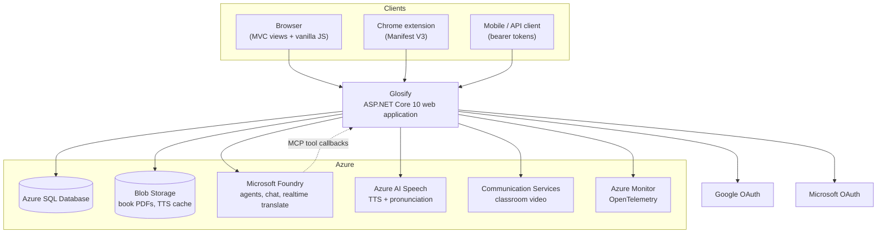

The arrow from Foundry back to the application is the one that is easy to miss
and shapes several decisions: assistant tools are hosted as an **MCP server**
inside this same process, so Foundry-hosted agents call back in over HTTP. That
inbound path has its own authentication, its own rate-limit partition, and its
own trust model (§7, §11.4).

### Actors

| Actor | Reaches the system through | Authenticates with |
|---|---|---|
| Learner (web) | MVC views + JSON endpoints on the same origin | Identity cookie |
| Learner (extension) | `/api/*` + a WebSocket relay | Bearer token obtained via PKCE code exchange |
| Learner (mobile) | `/api/*` and `/api/auth/*` | Bearer token from `MapIdentityApi` |
| Admin | `/Admin/*` | Identity cookie + `AiCreditAdmin` policy (email allowlist) |
| Employer / demo visitor | `/demo?code=…` | Shared seeded demo account |
| Foundry agent | `/assistant/mcp/s/{sessionToken}` | Shared secret + signed session token naming the acting user |

---

## 2. Deployment topology

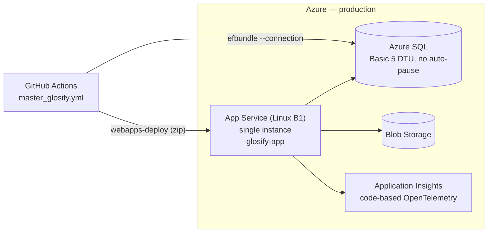

Properties that matter architecturally:

- **One instance, deliberately.** Scale-out is not enabled. A meaningful amount
  of state is process-local, catalogued in §10 and in
  [ADR 0001](adr/0001-single-instance-state.md).
- **Migrations run before the app, from CI, as a separate identity.** The build
  job produces an EF *migration bundle* (`efbundle`, `linux-x64`); the deploy job
  runs it against production SQL and only then pushes the app package. The
  runtime identity therefore never needs schema permissions.
- **Azure SQL is Basic 5 DTU and does not auto-pause.** The app still uses general
  connection resiliency: `ConnectTimeout` is floored at 120s
  (`BuildResilientSqlConnectionString` in `Program.cs`), `CommandTimeout` is 120s,
  and `EnableRetryOnFailure(maxRetryCount: 10, maxRetryDelay: 30s)` is on.
- **Liveness and readiness are separated.** `/healthz` has
  `Predicate = _ => false` — it answers as soon as the host serves, so a resuming
  database cannot make the platform recycle the app. `/readyz` runs the
  `DatabaseReadinessHealthCheck` (tag `ready`).
- **TLS terminates at the App Service front end.** `UseForwardedHeaders` runs
  first in the pipeline with the proxy allowlist explicitly cleared, because App
  Service front-end addresses are not statically known. Without this every user
  would share one rate-limit partition.

---

## 3. Solution structure

`Glosify.slnx` contains four projects. The application is deliberately **one**
project.

| Project | Role |
|---|---|
| `Glosify/` | The entire web application: controllers, services, EF model, views, static assets |
| `Glosify.Tests/` | xUnit unit + integration + contract tests (`WebApplicationFactory`) |
| `Glosify.BrowserTests/` | Playwright user journeys against a running instance |
| `Glosify.ClientTests/` | `node --test` for browser JS modules |
| `Glosify.LiveSubtitles.Extension/` | Manifest V3 Chrome extension (+ its own `node --test` suite) — not an MSBuild project |

Rough size (`find Glosify -name '*.cs' -not -path '*/obj/*' -not -path '*/bin/*' -not -path '*/Migrations/*' | xargs wc -l`): **~34,000 lines of C#** across
37 controller files, 186 service files, 29 entities, and 58 Razor views.

### Why one project

There is no `Glosify.Domain`, `Glosify.Infrastructure`, or `Glosify.Application`
assembly. The stated reason is that splitting would not solve a problem the
project currently has: there is one deployable, one database, and one team. The
boundaries that would otherwise be assembly boundaries are enforced by namespace
and folder instead:

```text
Glosify/
  Program.cs              Composition root + pipeline (the only place both are visible)
  Extensions/             Registration helpers called by Program.cs
  Controllers/            HTTP concerns only
    Api/                  JSON surface for extension + mobile
    Classrooms/           Classroom controllers, sharing ClassroomControllerBase
  Services/               Application logic, one folder per feature area
  Models/
    Entities/             EF-mapped persistence types
    ViewModels/           Razor-facing shapes
    Requests/ Api/        Bound request DTOs and API response shapes
  Data/
    GlosifyContext.cs     IdentityDbContext<ApplicationUser>
    Configurations/       One IEntityTypeConfiguration per entity
  Infrastructure/
    Api/                  Problem Details, exception mapping, MVC filters
    Concurrency/          Keyed async lock
    Health/               Readiness check
  Filters/ Hubs/ ViewComponents/ Migrations/ wwwroot/
```

`InternalsVisibleTo("Glosify.Tests")` is set, which lets internal collaborators
(`AssistantTurnRunner`, `AssistantOrchestrator`, …) stay internal while remaining
directly testable. That is the tradeoff that makes the single-project structure
workable: encapsulation without a public API surface built for tests.

---

## 4. Layering and dependency rules

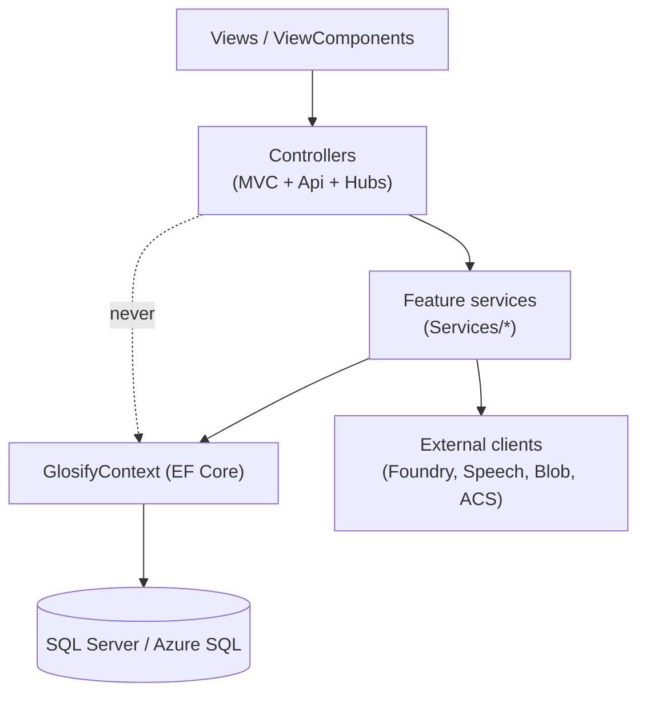

The rules, as the code actually observes them:

1. **Controllers do HTTP, not logic.** They bind and validate input, resolve the
   caller's user id (`ClaimsPrincipalExtensions`), call one service, and shape a
   result. Ownership checks live in services, not controllers.
2. **Services own a use case and the transaction around it.** They take
   `GlosifyContext` directly and call `SaveChangesAsync` themselves.
3. **There is no repository layer, on purpose.** `DbContext` already is a unit of
   work plus a set of repositories; wrapping it would add a layer whose only job
   is to forward calls, and would cost the ability to compose `IQueryable`
   projections in the service. The consequence accepted in exchange: services are
   tested against SQLite/InMemory providers or real integration hosts rather than
   against a mocked repository interface.
4. **Cross-service calls go through interfaces**, and the interface lives beside
   its implementation in the feature folder (`IQuizService` next to
   `QuizService`). Interfaces exist where there is a substitution need — a fake in
   tests, a provider swap, a second implementation — not reflexively for every
   class.
5. **Exceptions are the failure channel across the layer boundary.** Expected
   service failures use typed exceptions such as `QuizNotFoundException`,
   `InsufficientAiCreditsException`, and `SpeakingSessionExpiredException`; the
   shared mapper and MVC filters translate supported types into stable Problem
   Details responses (§8). Preconditions that are not part of that typed domain
   contract can still surface as ordinary exceptions and receive the sanitized
   unexpected-error response. Some controller actions still map expected validation
   and not-found failures locally; supported exceptions left unhandled by an action
   flow through the shared mapper and filters.

### Feature slices

Each folder under `Services/` is a slice with its own models, options, exceptions
and, where relevant, its own background service:

| Slice | Contents of note |
|---|---|
| `Quizzes/` | `QuizService`, `CollectionService`, `QuizAttemptService`, `QuizRepairService`, `QuizSessionRegistry` (in-memory) |
| `Words/`, `Flashcards/`, `Typing/` | The practice modes over the same word/sentence data |
| `CustomQuizzes/` | Element-based custom quiz model + template catalog |
| `Ai/` | Credit ledger, provider abstraction (`Generation/`, `Llm/`), `Assistant/` (tools, MCP, orchestration) |
| `Speaking/` | Session store, agent client, scene tool runtime, telemetry, cleanup service |
| `Speech/` | Azure TTS + short-lived Speech authorization tokens |
| `RealtimeTranslation/` | Relay, protocol, token store, transcripts, billing, cleanup service |
| `Books/` | PDF extraction, document service, page-translation coordinator |
| `Storage/` | Blob-backed book file storage |
| `Classrooms/` | Seven capability services over shared `ClassroomAccess` + `ClassroomQueries` |
| `Auth/` | PKCE, extension/mobile authorization code stores, external account linking, demo seeding |
| `Communication/` | ACS token issuance |
| `Language/` | Cookie-backed language context and catalog |

The classroom slice is the clearest example of the intended shape: one *access*
service that owns role checks, one *queries* service holding unchecked reads, and
then narrow capability services (`IClassroomRoster`, `IClassroomLibrary`,
`IClassroomConversation`, `IClassroomPlanner`, `IClassroomResults`,
`IClassroomCall`, `IClassroomDirectory`) that compose them. Authorization is
therefore written once, not once per controller action.

---

## 5. Composition root and lifetimes

`Program.cs` is the only file where the full service graph and the full pipeline
are both visible. It delegates registration to four extension methods so it stays
readable:

| Call | File | Registers |
|---|---|---|
| `AddGlosifyAuthentication` | `Extensions/AuthenticationExtensions.cs` | Identity, cookie hardening, bearer scheme, optional Google/Microsoft |
| `AddGlosifyRateLimiting` | `Extensions/RateLimitingExtensions.cs` | The single partitioned global limiter |
| `AddGlosifyServices` | `Extensions/ApplicationServiceExtensions.cs` | Options binding + the whole application service graph |
| `UseGlosifySecurityHeaders` | `Extensions/SecurityHeaderExtensions.cs` | CSP, Permissions-Policy, nosniff, Referrer-Policy |

### Lifetime policy

The rule the graph follows: **scoped by default; singleton only for things that
are genuinely process-wide and hold no `DbContext`.**

- **Scoped** — anything that touches `GlosifyContext`: every feature service,
  `AiCreditService`, the assistant collaborators, and `IGenerativeAiClient`
  implementations. The request-scoped storage and speech adapters
  `IBookFileStorage`, `ITextToSpeechService`, and
  `ISpeechAuthorizationTokenService` are scoped as well.
- **Singleton** — process-wide state and stateless clients:
  `IQuizSessionRegistry`, `ISpeakingSessionStore`,
  `IExtensionAuthorizationCodeStore`, `IMobileAuthorizationCodeStore`,
  `IRealtimeTranslationRelayTokenStore`, `IKeyedAsyncLock`,
  `IFoundryTranslationRelay`, `IClassroomCallPresence`,
  `ICustomQuizTemplateCatalog`, `ISpeakingAgentClient`,
  `IFoundryAgentInvoker`, `TokenCredential`, `AIProjectClient`, `TimeProvider`.
- **Hosted services** — `RealtimeTranslationCleanupService` and
  `SpeakingSessionCleanupService` sweep expired process-local sessions.

`TimeProvider.System` is registered as a singleton and injected wherever time
matters (credit ledger, session expiry, token lifetimes), which is what makes
`Microsoft.Extensions.TimeProvider.Testing` usable in tests instead of `Thread.Sleep`.

### Provider selection as a factory registration

The generative-AI provider is chosen at resolve time, not at startup:

```csharp
services.AddScoped<IGenerativeAiClient>(services =>
    provider == GenerativeAiOptions.GeminiProvider
        ? services.GetRequiredService<GeminiGenerativeAiClient>()
        : services.GetRequiredService<FoundryGenerativeAiClient>());
```

Both concrete clients are registered, so `GenerativeAi:Provider` is a
**deployment-level rollback switch** — an App Service setting change, not a
deploy. The Gemini path exists only for that purpose.

### Fail-fast configuration

Options that would fail confusingly at first use are validated at startup with
`.ValidateOnStart()` plus a dedicated `IValidateOptions<T>` validator:
`GenerativeAiOptions`, `AiUsageOptions`, `RealtimeTranslationOptions`,
`SpeakingOptions`, `AssistantMcpOptions`. A missing `DefaultConnection` throws
directly in `Program.cs` with a message naming the environment variable to set.
`ServiceGraphTests` asserts the container can build the whole graph, which is
what catches a captive-dependency mistake before deployment does.

---

## 6. The request pipeline

Middleware order is a contract; several orderings here are load-bearing rather
than conventional. Reading `Program.cs` top to bottom:

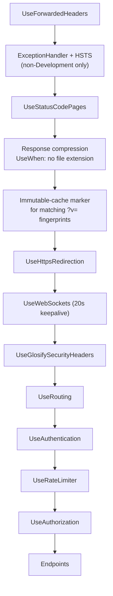

Load-bearing details:

- **`UseForwardedHeaders` first**, or `RemoteIpAddress` is the front end and
  IP-partitioned rate limits collapse into one bucket.
- **The exception handler is registered only outside Development.** Registering
  it unconditionally would place it *inside* the developer exception page and
  swallow the exception before that page saw it.
- **`UseAuthentication` before `UseRateLimiter`**, so the assistant and per-user
  limits can partition on the user id claim rather than on IP.
- **Compression is branched with `UseWhen`.** Static assets already ship
  build-time compressed representations from `MapStaticAssets`; wrapping their
  send-file responses in dynamic compression can emit a `Content-Encoding` header
  with an empty body on some hosts. The branch predicate is
  `!Path.HasExtension(...)`, i.e. dynamic compression applies only to routed
  HTML/JSON.
- **A custom middleware upgrades cacheable static responses.** `MapStaticAssets`
  publishes a fingerprinted immutable route and a plain no-cache route; views
  link the plain path with `asp-append-version`, so every asset was being
  revalidated on every navigation. The middleware asks `IFileVersionProvider` for
  the version it *would* generate now and, if it matches the request's `?v=`,
  stamps `max-age=31536000, immutable`. ETags are deliberately not used for this:
  compressed representations carry their own ETags computed over compressed
  bytes, so the comparison would fail for every browser that sends
  `Accept-Encoding`.

### Endpoint map

| Route | Purpose |
|---|---|
| `/healthz`, `/readyz` | Liveness / readiness, both `AllowAnonymous` |
| `/` → `Home/Index`, `/login`, `/demo`, `/Quizzes/{action}/{id?}`, `{controller}/{action}/{id?}` | MVC |
| Razor Pages | Identity UI — **not** `AllowAnonymous`, because Identity protects `/Identity/Account/Manage` via `AuthorizeAreaFolder` conventions, and `IAllowAnonymous` metadata would short-circuit authorization and silently disable them |
| `/hubs/classroom-chat` | SignalR hub |
| `/api/auth/*` | `MapIdentityApi<ApplicationUser>()`, `AllowAnonymous` (required because of the fallback policy) |
| `/assistant/mcp/s/{sessionToken}` | MCP server for Foundry agent tool calls |
| `/openapi` | Development and Testing only |

---

## 7. Identity, authentication, and authorization

Six credential shapes coexist. They are separate because they have genuinely
different threat models and lifetimes.

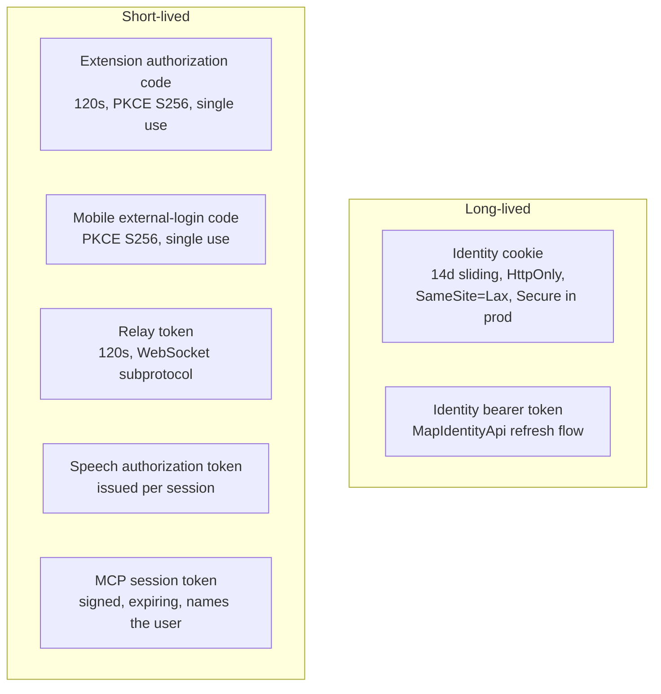

### Authorization posture

**Deny by default.** A fallback policy requiring an authenticated user is applied
globally:

```csharp
options.FallbackPolicy = new AuthorizationPolicyBuilder().RequireAuthenticatedUser().Build();
```

Every endpoint that must stay open therefore opts out explicitly, and forgetting
`[Authorize]` fails closed rather than open. The single named policy,
`AiCreditAdmin`, is an assertion over an email allowlist from `Admin:Emails`.

**Ownership is checked in services, not by a policy.** Resources are owned by a
`UserId` string; services filter by it and throw `UnauthorizedAccessException` or
a not-found exception rather than returning another user's row. That choice keeps
authorization next to the query that would otherwise leak.

### External identity

Google and Microsoft handlers are registered **only when their client id *and*
secret are configured**. That is why an offline development machine falls back
cleanly to email/password: the buttons are absent because the schemes are absent.
Both handlers override `OnRemoteFailure` to log and redirect to
`/login?externalLoginError=…` instead of surfacing a provider error page.

### PKCE for non-browser clients

`Services/Auth/Pkce.cs` implements RFC 7636 S256 once and both the extension and
mobile external-login flows use it. Two details worth noting as deliberate:

- The authorization code is **consumed before the verifier is validated**, so a
  guessed verifier cannot be retried against the same code.
- Verifier/challenge comparison is fixed-time, since a timing signal would leak
  the challenge byte by byte.

### The relay token

The subtitle WebSocket cannot carry an `Authorization` header (browser WebSocket
APIs do not allow one), so the relay token travels as a **WebSocket
subprotocol**, is single-use, lives 120 seconds, and is redeemed by
`RealtimeTranslationRelayTokenStore.TryRedeem` before the socket is accepted. The
relay controller is `[AllowAnonymous]` + `[IgnoreAntiforgeryToken]` precisely
because the token, not the cookie, is the credential on that path.

### The MCP callback

Foundry authenticates as **one shared identity with no user claim**. Trusting
that identity alone would make every user's tools reachable by any agent
response. Instead the acting user travels inside a signed, short-lived session
token in the route (`/assistant/mcp/s/{sessionToken}`), and an endpoint filter
rejects a missing signing key, a wrong shared secret, or an expired session. The
rate limiter partitions on that session token for the same reason (§8).

---

## 8. The failure contract

Every failure the API can produce is an RFC 9457 Problem Details document with a
stable machine-readable `code`. Three components produce it:

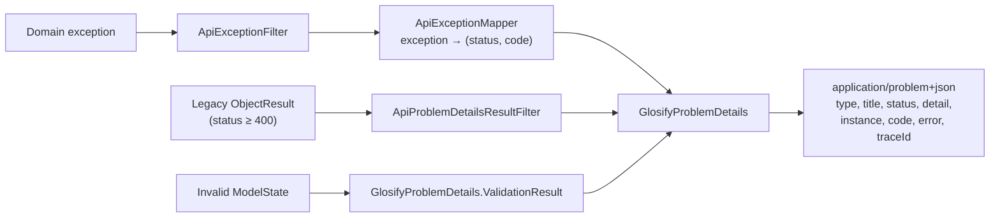

- `ApiExceptionMapper` is a single `switch` expression mapping ~25 domain
  exception types onto status + code — `InsufficientAiCreditsException` → 402,
  `MonthlyAiBudgetExceededException` → 503, `*TimeoutException` → 504,
  `*UpstreamException` → 502, `*ExpiredException` → 410, and so on. Adding an
  exception type without adding a mapping yields a 500, which is the safe default.
- `ApiProblemDetailsResultFilter` catches hand-written error results that predate
  the contract (`return BadRequest(new { error = "..." })`) and rewrites them into
  the canonical shape, lifting `error` into `detail` and `errors` into an
  extension. It only applies where `IApiBehaviorMetadata` is present, so MVC view
  results are untouched.
- `traceId` comes from `Activity.Current?.Id` when a trace is active, falling back
  to `HttpContext.TraceIdentifier` — so a user-reported error id resolves in
  Application Insights.
- `error` is a **compatibility alias for `detail`**, retained under an explicit
  exit condition. See [ADR 0002](adr/0002-problem-details-compatibility.md);
  contract tests assert it stays present and identical until that condition is met.
- `AddProblemDetails()` plus `UseStatusCodePages()` mean even a bare 401/403/404
  from the middleware — which would otherwise have no body at all — returns JSON
  to API callers and a short plain-text line to browsers.

### Rate limiting

One `GlobalLimiter` with a path-based partition function; anything not named is
unlimited (`RateLimitPartition.GetNoLimiter("default")`). The partition key
encodes the threat being priced:

| Path | Partition | Limit |
|---|---|---|
| POST to `/login`, `/Account`, `/api/auth`, `/api/extension-auth`, `/Identity/Account` | IP | 20 / min |
| `/assistant/mcp/…` | MCP session token (falls back to IP) | 120 / min |
| Anything containing `/Assistant` | User id | 60 / min |
| `/api/tts` | User id | 60 / min |
| `POST /Books/Upload`, `POST /api/books` | User id | 3 / 10 min |
| `/Books/**/Translation*` | User id | 12 / min |
| `/api/speaking/speech-token` | User id | 12 / min |
| `/api/speaking/*` | User id | 30 / min |
| `/api/realtime-translation/*` | User id | 90 / min |
| POST `/Classroom/*` | User id | 30 / min |
| `/demo` | IP | 10 / 5 min |

Two of these carry reasoning worth preserving. The **MCP rule must precede the
assistant rule**, which would otherwise match the same path and drop every user's
tool calls into a single Foundry-identity bucket. The **demo rule** exists because
the demo link is meant to appear on a CV and will be crawled — each wrong access
code costs an attacker a request against the window.

Counters are in-process, which is one of the reasons scale-out is gated (§10).

---

## 9. Data architecture

### The context

`GlosifyContext : IdentityDbContext<ApplicationUser>` — 29 mapped entity types
plus the Identity tables. `OnModelCreating` does exactly one thing:

```csharp
modelBuilder.ApplyConfigurationsFromAssembly(typeof(GlosifyContext).Assembly);
```

Every entity has its own `IEntityTypeConfiguration` in `Data/Configurations/`,
**including the Identity types**. Those exist to pin key lengths to the existing
schema; newer Identity package defaults would otherwise scaffold unrelated
widening migrations.

### Entity groups

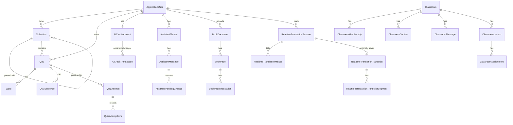

Five clusters, each roughly matching a service slice: **practice** (Collection /
Quiz / Word / QuizSentence / attempts), **AI accounting** (account / transaction /
monthly budget), **assistant** (thread / message / pending change), **content**
(book documents, pages, translations; realtime transcripts), and **classroom**.
`CustomQuiz` and `AcsUserIdentity` sit alongside.

Notable modelling choices:

- **`Word.Id` is a string, `Quiz.Id` is a `Guid`.** The word id is client-visible
  and used as a DOM/tool handle.
- **`Quiz` carries three language fields** (`SourceLanguage`, `TargetLanguage`,
  `Language`) plus per-direction Anki tracking flags, because practice direction
  and item type are user-selectable dimensions rather than fixed per quiz.
- **Sharing is a copy, not a reference.** `Quiz.OriginalQuizId` and
  `Collection.OriginalCollectionId` record provenance of a copied public item, so
  the copy is independently editable and the original is not mutated.
- **`AiCreditAccount.RowVersion` is a `rowversion`**, which is the basis of the
  optimistic-concurrency retry in §11.3.

### Migrations

The checked-in history starts from a single complete `InitialCreate`
(`20260809100614_InitialCreate`). There is no generated-schema shortcut and no
forged history — CI proves it every run from the repository root:

```bash
dotnet ef database update --project Glosify/Glosify.csproj --configuration Release --no-build
dotnet ef migrations has-pending-model-changes --project Glosify/Glosify.csproj --configuration Release --no-build
```

CI runs these commands against the fresh SQL Server service container created for
each job. In that clean environment, the first step proves a new database can be
built from migrations alone; when run manually against an existing server it only
updates that server to the latest migration. The second step proves the model and
the migrations have not drifted apart. Both run on pull requests, so a schema
change represented by the EF model cannot merge without a matching migration.

### Concurrency and integrity

- `DeleteBehavior.NoAction` appears on many foreign keys — SQL Server rejects
  multiple cascade paths, and several entities are reachable from
  `ApplicationUser` by more than one route. Deletion order is therefore explicit
  in the services (see `CollectionServiceDeleteTests`, `QuizServiceDeleteTests`,
  `BookDeletionTests`).
- `IKeyedAsyncLock` (`ReferenceCountedKeyedAsyncLock`) serialises work per key
  in-process — used where a second concurrent request for the same key would
  duplicate an expensive external call rather than corrupt data. Reference
  counting is what keeps the dictionary from growing without bound.

---

## 10. State: what is durable and what is not

This is the single most important table in the document, because it is what makes
the deployment single-instance.

| State | Where it lives | Survives restart? |
|---|---|---|
| Users, quizzes, words, attempts, books, classrooms, transcripts | Azure SQL | Yes |
| Credit balances and the transaction ledger | Azure SQL | Yes |
| Assistant threads, messages, pending changes | Azure SQL | Yes |
| Book PDFs, TTS cache | Blob Storage | Yes |
| Active practice-session progress | `QuizSessionRegistry` + `IMemoryCache` | **No** |
| Speaking session handles + cleanup schedule | `SpeakingSessionStore` | **No** |
| Extension / mobile authorization codes | In-memory stores | **No** |
| Realtime relay tokens, active relay coordination | In-memory store + `FoundryTranslationRelay` | **No** |
| Rate-limit counters | In-process limiter | **No** |
| Keyed translation locks | `ReferenceCountedKeyedAsyncLock` | **No** |
| SignalR connections + classroom call presence | `HubClassroomCallPresence` | **No** |
| Data-protection keys | Default (no external key ring configured) | **No** |

Consequences, accepted knowingly in
[ADR 0001](adr/0001-single-instance-state.md): a restart or deploy ends active
practice, speaking, and subtitle sessions and invalidates outstanding short-lived
codes. Running two instances would break these *silently* rather than loudly —
which is exactly why the ADR names the migration required before scale-out (§15).

---

## 11. Feature architectures

### 11.1 The practice spine

The core loop — pick a quiz, practise it, record the result — is the trunk that
every other feature branches off.

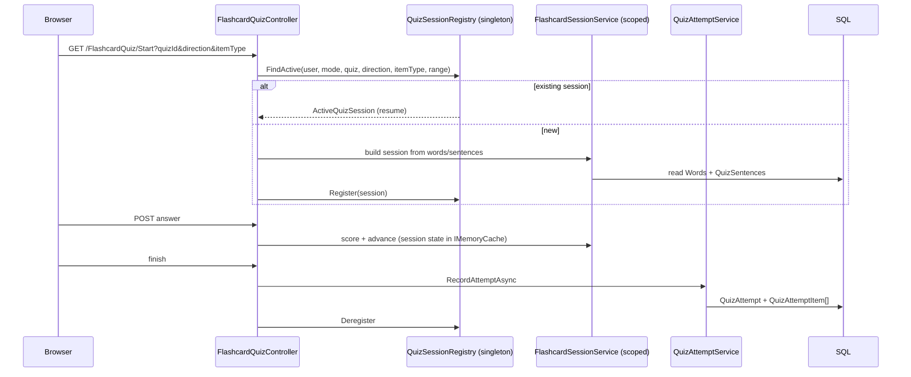

Three practice modes (flashcard, typing, custom-quiz player) share the quiz/word
data and the attempt recording, but each owns its own session service. The
registry caps five active sessions per user and evicts the oldest — the reason it
exists at all is that browser back-navigation should resume a session rather than
silently start a new one and lose progress.

Practice is parameterised by `PracticeDirection`, `PracticeItemType`, and a
`PracticeRange` percentage window, and those parameters are part of the session
identity — changing direction genuinely starts a different session.

### 11.2 Generative AI plumbing

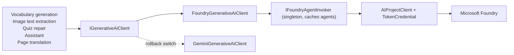

- **One interface, two providers.** `GenerativeAi:Provider` selects between them
  at resolve time (§5). Gemini exists only as an explicit deployment-level
  rollback during the Foundry soak.
- **Model roles, not model names, at the call site.** Configuration names a
  deployment per role — `AssistantDeployment`, `StructuredDeployment`,
  `VisionDeployment`, `PageTranslationDeployment`, plus
  `PageTranslationFallbackDeployment` — resolved by `IGenerativeAiModelResolver`.
  Swapping a model is a settings change.
- **Authored agents over inline prompts where behaviour is stable.**
  `GenerativeAi:Foundry:Agents` pins a *name and version* per agent
  (`glosify-quiz-builder` v3, `glosify-quiz-assistant` v3, `glosify-librarian`
  v3). Each profile falls back to in-code instructions when no agent is
  configured, so the app runs without Foundry-side setup.
- **Structured output is validated, not trusted.** Model responses that become
  data go through validation that throws `GenerativeAiValidationException` → 400
  rather than persisting a malformed shape.
- **Foundry and Speech credentials are never keys in production.**
  `FoundryCredentialFactory` builds `DefaultAzureCredential` locally (hence
  `az login`) and uses managed identity in Azure. The explicit Gemini rollback
  provider is the exception: it requires `Gemini__ApiKey` (preferred) or the
  temporary legacy `GEMINI_API_KEY` App Service secret setting. Rotate that key
  at the provider and replace the App Service setting without checking it into
  source or emitting it in logs.
- **Telemetry per surface.** `GenerativeAiTelemetry`, `SpeakingTelemetry`, and
  `RealtimeTranslationTelemetry` each expose an `ActivitySource` and a `Meter`,
  registered with OpenTelemetry only when an Application Insights connection
  string is present.

### 11.3 The AI credit ledger

Every AI call costs credits, and cost is only known *after* the call. The ledger
therefore uses reserve → commit/release, and `AiCreditTransaction` is append-only:
the balance is a materialised column, but every change to it has a row.

```mermaid
sequenceDiagram
    participant S as Feature service
    participant L as AiCreditService
    participant P as AI provider

    S->>L: ReserveAsync(context, provider, model, estimatedTokens)
    L->>L: trial grant if first use
    L->>L: check AvailableCredits = Balance - Reserved
    L->>L: check monthly SEK budget
    L-->>S: reservationId (Reserved += required)
    S->>P: call
    alt provider returned usage
        S->>L: CommitUsageAsync(reservationId, actualUsage)
        L->>L: Reserved -= reserved; Balance -= actual
        L->>L: write usage_debit (+ release row if over-reserved)
        Note over S,L: Charge remains even if local validation or later handling fails
    else failed before confirmed provider usage
        S->>L: ReleaseAsync(reservationId)
        L->>L: Reserved -= reserved; write release row
    end
```

Design points:

- **Two units.** Token billing (`ReserveAsync` / `CommitUsageAsync`) and duration
  billing for realtime audio (`ReserveDurationAsync` /
  `CommitDurationUsageAsync`). The duration methods are default interface methods
  throwing `NotSupportedException`, so a substitute implementation opts in.
- **Provider work is billable.** Once a provider response supplies usage—or a
  completed speaking turn requires the configured estimate—the learner receives a
  normal usage debit even if local validation rejects the result. A failure before
  confirmed billable work releases the reservation. Recovery after a request-scoped
  save failure uses an independent context and detaches uncertain tracked credit state.
- **A second, independent ceiling.** Beyond per-user credits there is a monthly
  **SEK budget** (`AiUsage:MonthlyBudget`) with per-deployment input/output
  prices, a `ReservationSafetyMultiplier` of 1.25, and a `Europe/Stockholm`
  period key. Exceeding it raises `MonthlyAiBudgetExceededException` → 503. This
  is the actual protection against a runaway spend; credits protect fairness
  between users, the budget protects the owner's wallet.
- **Optimistic concurrency with a scoped retry.** `AiCreditAccount.RowVersion`
  plus `WithConcurrencyRetryAsync` re-reads and retries on conflict. The retry
  deliberately **does not** call `ChangeTracker.Clear()`: the service shares the
  request's `DbContext`, and clearing detached entities that callers were still
  tracking, silently turning their later `SaveChangesAsync` into a no-op — users
  were charged for realtime minutes the session never recorded. It detaches only
  the entities it owns. This is the sharpest example in the codebase of the cost
  of the "services share the request `DbContext`" decision, and the comment on
  that method should be read before touching it.
- **Prices are appended, never reordered.** App Service has historically
  overridden `Models__N__*` by index, so inserting a row rebinds settings onto
  the wrong model.

### 11.4 The assistant

The assistant is the largest subsystem: a tool-calling loop with a
propose–review–apply safety model, reachable both in-process and, for
Foundry-hosted agents, over MCP.

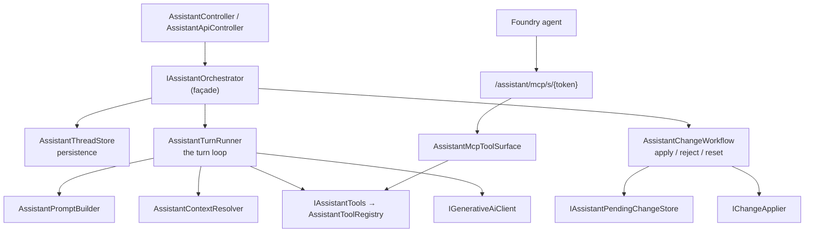

- **The orchestrator is a façade only.** It holds no logic; it forwards to three
  scoped collaborators. That keeps the controller-facing signatures and routes
  stable while the internals are refactored — and it is why the collaborators can
  be `internal` and still unit-tested.
- **~45 tools, one class each**, implementing `IAssistantTool` under
  `Services/Ai/Assistant/Tools/`, registered by `AssistantToolServiceExtensions`.
  Tool *surfaces* (which tools a given profile may call) are selected by the page
  the user is on: `AssistantToolSurfaces` fixes both the tool set and which
  authored agent supplies the instructions.
- **Propose, review, apply.** Mutating tools do not write. They record an
  `AssistantPendingChange` attached to the assistant message; the user reviews the
  diff and applies or rejects it, at which point `IChangeApplier` performs the
  write. This is the primary defence against prompt injection from book pages and
  transcripts: untrusted text cannot silently mutate a user's data.
- **The turn loop is bounded.** `MaxToolTurns = 24`, and replayed history is
  windowed — a single user turn can persist up to `1 + MaxToolTurns*2 + 1`
  messages, so the window must exceed that to keep the previous full exchange.
  The window start advances to the first plain-text user message, because
  providers reject histories where a function response has no preceding call.
- **Context is explicit and user-selected**: a quiz to act on, plus a book or a
  saved transcript to read from. Message parts are persisted in a stored shape
  (`StoredContent`/`StoredPart`) that round-trips text, function calls, function
  responses, call ids, and thought signatures.
- **MCP is a transport, not a second implementation.** `AssistantMcpToolSurface`
  exposes the same registry over `ModelContextProtocol.AspNetCore`, so a tool is
  written once regardless of whether the model runs in-process or in Foundry.

### 11.5 Speaking practice

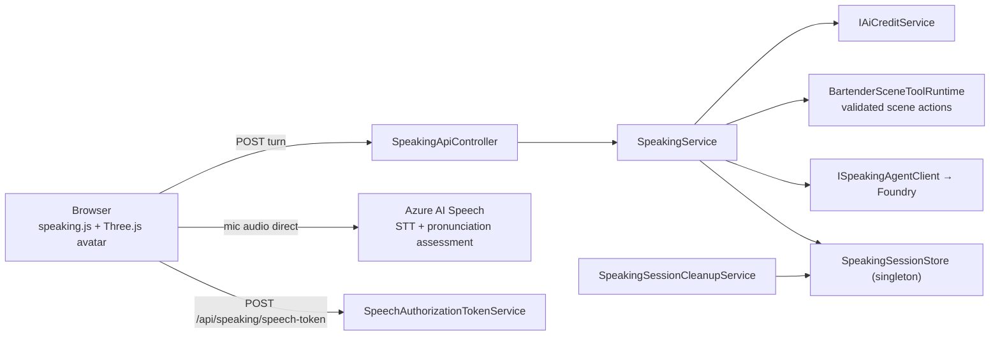

- **The browser talks to Azure Speech directly**, using a short-lived
  authorization token minted by the server. Audio never transits the app, which
  removes both a bandwidth cost and a data-retention question — at the price of
  the token endpoint needing its own rate limit (12/min/user).
- **Scene state is server-authoritative.** The agent may request scene actions
  (pour a drink, change expression); `BartenderSceneToolRuntime` validates them
  against `BartenderInteractionState` before the client animates anything. The
  client renders state, it does not decide it.
- **Sessions are capped and expiring**: `MaxSessionsPerUser: 3`,
  `SessionTtlMinutes: 60`, swept by a hosted service.
- **Avatars are configuration.** `SpeakingAvatarCatalog` plus the per-persona
  agent name/version map in `Speaking:Agents` — a dozen language-specific
  personas, each pinned to an authored agent version. Adding one is config plus a
  Three.js scene module, not a code path.

### 11.6 Books and Blob Storage

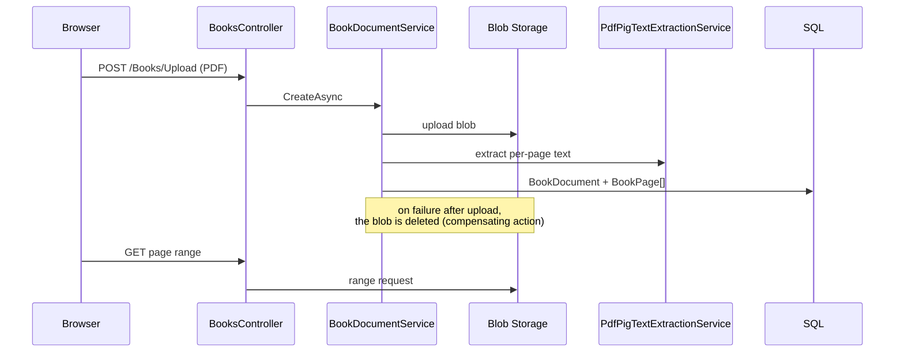

Two ordering rules do the work here. On **create**, the blob is written first and
deleted as a compensating action if the database write fails — an orphaned blob
is cheap; a row pointing at a missing blob is not. On **delete**, the row goes
first and the blob after, for the same asymmetry. There is no distributed
transaction and none is wanted; the ordering is the design.

Page text extracted by PdfPig becomes assistant context (§11.4), which is why
book pages are treated as untrusted input.

### 11.7 Realtime translation and the extension

The most involved data path in the system: a Chrome extension captures tab audio
and the app proxies it through one of two server-selected subtitle pipelines.

```mermaid
sequenceDiagram
    participant P as Extension popup
    participant SW as Service worker
    participant Off as Offscreen document
    participant Api as RealtimeTranslationApiController
    participant Relay as RealtimeTranslationRelayController
    participant Router as Relay/provider routers
    participant Up as Foundry or ElevenLabs
    participant Tr as Azure Translator
    participant DB as SQL

    P->>SW: start
    SW->>Api: POST /api/realtime-translation/sessions (bearer)
    Api->>DB: RealtimeTranslationSession + duration reservation
    Api-->>SW: sessionId + relay token (120s)
    SW->>Off: create offscreen doc, tabCapture
    Off->>Relay: WSS …/stream, token in subprotocol
    Relay->>Relay: TryRedeem(token) → authorization
    Relay->>Router: RelayAsync(browserSocket, canonical authorization)
    Router->>Up: stream PCM audio
    loop while streaming
        Off->>Relay: PCM audio frames
        Up-->>Router: translated events or finalized speech
        Router->>Tr: finalized speech (Scribe mode only)
        Router-->>Off: translation events → content script overlay
        Router->>DB: RealtimeTranslationMinute (per started minute)
    end
    Router->>DB: finalize session; optional transcript
```

- **Modes are first-class catalog choices.** Scribe uses ElevenLabs
  `scribe_v2_realtime` plus Azure Translator; Enhanced uses Microsoft Foundry
  realtime translation. The server
  derives and persists the canonical speech provider from the mode and carries
  it in the single-use relay authorization.
- **Scribe is fail-closed.** Its API key remains server-side, only finalized VAD
  commits are translated, and an upstream failure ends that Scribe session
  without silently switching providers.

- **Audio is not stored by Glosify.** Saving the original-language transcript is opt-in
  (`SavedSourceTranscriptsEnabled`) and costs double
  (`SavedTranscriptCreditsPerStartedMinute: 16` vs `CreditsPerStartedMinute: 8`)
  because Enhanced tees the same PCM audio to Scribe for finalized source
  transcription. Scribe subtitle sessions reuse their existing finalized text.
- **Languages are catalog-driven.** The server caches Azure Translator's current
  target-language catalog for 24 hours and supplies it to the extension, with a
  configured fallback. Scribe receives no language hint by default; users may
  optionally select a compatible ISO hint when Scribe is active.
- **Billing is per started minute**, written as `RealtimeTranslationMinute` rows
  as the session runs, with a `RelayBillingGraceSeconds` allowance — so a
  disconnect mid-session has already been paid for what it used.
- **Liveness is enforced from both ends**: `HeartbeatSeconds: 15`,
  `StaleSessionSeconds: 60`, `MaxSessionMinutes: 30`,
  `RelayStartupTimeoutSeconds: 15`, and a
  `RealtimeTranslationCleanupService` sweeping abandoned sessions.
- **Relay failures are typed and mapped**, so the extension receives a Problem
  Details body or a close frame with a specific reason rather than a bare socket
  close: `Expired` → 410, `Unavailable` → 503, `Upstream` → 502.
- The whole feature is behind `RealtimeTranslation:Enabled`, default `false`.

### 11.8 Classrooms

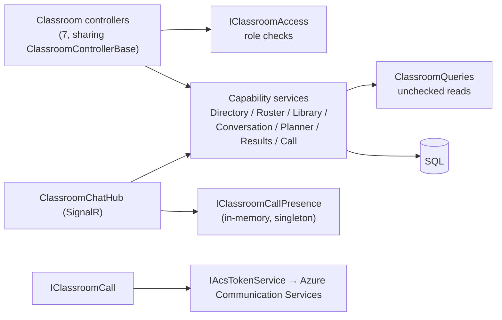

Role checks (`ClassroomRole`, `ClassroomMembership`) are centralised in
`ClassroomAccess`, which throws `ClassroomAccessDeniedException`. Chat runs over a
SignalR hub with per-classroom groups; call presence is an in-memory singleton
(hence §10). Video is Azure Communication Services, with the server issuing
scoped user tokens — the CSP `connect-src` list in `appsettings.json` exists to
let the ACS calling SDK reach its signalling and media endpoints.

---

## 12. Client architecture

**Server-rendered first, enhanced with plain JavaScript.** There is no SPA
framework, no bundler, and no npm build step for the web app. Views are Razor;
behaviour lives in ~20 modules under `wwwroot/js`, one per screen
(`quiz-library.js`, `flashcard-quiz.js`, `assistant.js`, `book-reader.js`,
`classroom-call.js`, the three Three.js avatar scenes, …).

Rules the client code follows, and the reasons:

- **No inline event handlers.** Behaviour attaches via `data-*` attributes, which
  is what allows a CSP without `script-src 'unsafe-inline'`. (`style-src` still
  needs `'unsafe-inline'` because views use style attributes — a known,
  documented gap.)
- **The only external script origin is jsDelivr**, for a pinned Three.js module.
- **Progressive enhancement where it is cheap, JSON round-trips where it is not.**
  Library and settings pages are forms; the assistant, practice modes, speaking,
  and the reader use JSON endpoints.
- **Testable modules are extracted.** `Glosify.ClientTests` runs `node --test`
  against dependency-free assistant state modules — the parts worth testing are
  pulled out of the DOM-coupled code so they can be.

### The Chrome extension

Manifest V3, minimum Chrome 116, in `Glosify.LiveSubtitles.Extension/`:

| Component | Role |
|---|---|
| `background/service-worker.js` | Auth, session lifecycle, message routing |
| `offscreen/offscreen.js` | Holds `tabCapture` and the relay WebSocket (a service worker cannot keep either alive) |
| `content/subtitles.js` | Renders the subtitle overlay on the page |
| `popup/` | Controls, language selection, credit display |
| `lib/` | Pure modules: `audio-pcm`, `relay-url`, `realtime-events`, `chat-buffer`, `billing`, `transcript-storage` |

The offscreen document exists because MV3 service workers are terminated
aggressively; long-lived capture and socket state must live somewhere that is
not the worker. `lib/` is deliberately dependency-free so the seven `test/`
suites can run under `node --test` with no browser.

Permissions are minimal and host permissions are limited to `glosify.se` and
localhost. The extension is a first-party client of the same API and the same
credit balance — not a separate product.

---

## 13. Cross-cutting concerns

### Configuration

Standard ASP.NET Core provider precedence. `appsettings.json` holds **non-secret
defaults only** and is checked in; `appsettings.Development.json` is git-ignored
and holds non-secret overrides; secrets live in user secrets locally and App
Service settings in production. Azure access uses `DefaultAzureCredential`
locally (`az login`) and managed identity in production, so no Foundry or Speech
key is needed in Azure at all.

`AllowedHosts` is pinned to the real hostnames rather than `*`.

### Options pattern

Every feature area binds a strongly-typed options class; the ones whose
misconfiguration would fail confusingly get a validator plus `ValidateOnStart`.
Options are injected as `IOptions<T>` (singleton-safe) rather than read from
`IConfiguration` at the call site, which is what keeps configuration reads out of
hot paths and makes settings testable (`ShippedConfigurationTests`,
`DemoAccountOptionsTests`, `RealtimeTranslationOptionsTests`,
`PageTranslationOptionsTests`).

### Resilience

`AddStandardResilienceHandler()` on the Speech `HttpClient`. Without it that
client would fall back to `HttpClient`'s 100-second default with no retry and no
circuit breaker, so a Speech regional brownout would hold a request thread for
the full 100 seconds per call. EF Core has its own retry strategy (§2).

### Observability

Azure Monitor OpenTelemetry is registered in application code **only when
`APPLICATIONINSIGHTS_CONNECTION_STRING` is present**, with three custom sources
and three custom meters (speaking, generative AI, realtime translation). App
Service platform/resource logs are routed separately through diagnostic setting
`glosify-app-operational`; `AppServiceAppLogs` is excluded there to avoid
duplicating the application logs exported through OpenTelemetry.

### Security headers

`UseGlosifySecurityHeaders` writes `X-Content-Type-Options`, `Referrer-Policy`,
`Content-Security-Policy`, and a restrictive `Permissions-Policy` that grants only
`microphone=(self)` and `camera=(self)` (needed by speaking and classroom calls)
and denies geolocation, payment, USB, and topics outright. CSP `form-action` and
`connect-src` extensions are configurable so a new ACS or Speech domain does not
require a code change; wildcard hosts are sanitised to a conservative character
set since they are valid CSP sources but not absolute URIs.

Antiforgery is global via `AutoValidateAntiforgeryTokenAttribute`; the two places
that opt out (the relay socket, the MCP endpoint) carry their own credentials.

---

## 14. Build, test, and delivery

### Build conventions

- `Directory.Build.props`: `net10.0`, nullable enabled, implicit usings,
  `TreatWarningsAsErrors`, `AnalysisLevel=latest`, `EnforceCodeStyleInBuild`,
  `NuGetAudit` in `all` mode. Audit findings are warnings locally so a newly
  published advisory does not block unrelated work; **CI clears that exception**
  in a dedicated audit restore step, so an advisory fails the build there.
- `Directory.Packages.props`: central package management with transitive pinning,
  so the app and the tests cannot drift onto different builds of a dependency.
- `Directory.Build.targets` removes `bin/**` and `obj/**` from the default item
  globs — a guard against an SDK glob-pruning bug that otherwise re-collects the
  previous build's output every build until the path is long enough to fail.
- `global.json` pins SDK `10.0.100` with `rollForward: latestFeature`.

### Test architecture

| Layer | Project | Tool | Scale |
|---|---|---|---|
| Unit + integration + contract | `Glosify.Tests` | xUnit, `WebApplicationFactory`, AngleSharp, SQLite/InMemory | 480 `[Fact]`/`[Theory]` across 74 files |
| Browser journeys | `Glosify.BrowserTests` | Playwright (Chromium) | 5 journeys against a running app |
| Browser JS modules | `Glosify.ClientTests` | `node --test` | assistant state modules |
| Extension JS | `Glosify.LiveSubtitles.Extension/test` | `node --test` | 7 suites over `lib/` |

Counts from `grep -rho "\[Fact\]\|\[Theory\]" --include="*.cs" <project> | wc -l`
and `ls`.

The interesting choices:

- **Hand-written fakes, not a mocking framework.** `ChromeServiceFakes`,
  `AssistantToolFactory`, `ClassroomServices`, `TestEnvironment` are shared test
  infrastructure; there is no Moq/NSubstitute dependency.
- **Contract tests guard the API shape.** `ApiProblemDetailsContractTests` is what
  makes ADR 0002's `error` alias a checked commitment rather than a note.
- **Tests assert on things that are easy to break invisibly**: view stylesheet
  references (`ViewStylesheetTests`), Material Symbol inventory
  (`MaterialSymbolInventoryTests`), shipped configuration
  (`ShippedConfigurationTests`), the service graph itself (`ServiceGraphTests`),
  Identity page authorization (`IdentityPageAuthorizationTests`).
- **Browser tests run the real built app** in the `Testing` environment, which is
  why `Program.cs` calls `UseStaticWebAssets()` for that environment — otherwise
  the tests would exercise empty placeholder assets.

### CI/CD

`.github/workflows/master_glosify.yml`, two jobs. **Build** (on PR and push):
restore → NuGet audit → build → migrate an empty SQL Server container and check
for pending model changes → xUnit → extension JS → client JS → Playwright →
publish → build the migration bundle → upload both artifacts. **Deploy** (push to
`master` only, `production` environment): OIDC login to Azure → run the migration
bundle against production SQL → deploy the package.

Two properties are worth naming: the deploy job holds **no long-lived Azure
credential** (federated OIDC, `id-token: write`), and **migrations are applied
before the new code starts**, from an identity separate from the runtime one.

---

## 15. Constraints and evolution paths

### Accepted limits

| Limit | Why it is accepted | What it would take to remove |
|---|---|---|
| Single App Service instance | The state in §10 is process-local | The ADR 0001 checklist: Redis for sessions/codes/rate limits, a SignalR or Redis backplane, data-protection keys in Blob or Key Vault, lease-based cleanup jobs, multi-instance integration tests |
| Linux App Service B1, one worker | Portfolio-scale traffic and process-local state | Complete the ADR 0001 scale-out checklist, then increase worker count/tier |
| Azure SQL Basic 5 DTU | Portfolio-scale traffic; current capacity is deliberately unchanged | Measure DTU/storage/connection headroom, then approve a tier change separately |
| No email confirmation flow | No `IEmailSender` is registered | Register one and flip `Identity:RequireConfirmedAccount` — no code change |
| `style-src 'unsafe-inline'` | Views use style attributes | Move inline styles to classes or add per-response nonces |
| One project, no domain assembly | No boundary is being violated today | Extract only when a second deployable or a genuine reuse case appears |
| `error` alias in Problem Details | Installed extension clients read it | The three-part exit condition in ADR 0002 |

### Where the seams already are

If the system does need to split, the cut lines exist:

- **Realtime translation** is nearly separable already — it has its own options,
  telemetry, billing unit, cleanup service, transport, and client. It shares only
  identity and the credit ledger.
- **The assistant tool surface** is exposed over MCP, so it is addressable from
  outside the process today.
- **Speaking** already offloads its heaviest traffic (audio) directly to Azure
  Speech, so the server side is stateless apart from the session store.

The dependency that would resist a split hardest is the **credit ledger**: every
AI feature reserves and commits against it, and it relies on `rowversion`
optimistic concurrency in a single database. It would need to become a service
with its own API before anything that spends credits could move out.

---

## 16. Appendix: where things live

| Looking for | Start at |
|---|---|
| The whole service graph | `Glosify/Extensions/ApplicationServiceExtensions.cs` |
| Middleware order and endpoint map | `Glosify/Program.cs` |
| Auth schemes and cookie policy | `Glosify/Extensions/AuthenticationExtensions.cs` |
| Every rate limit | `Glosify/Extensions/RateLimitingExtensions.cs` |
| CSP and security headers | `Glosify/Extensions/SecurityHeaderExtensions.cs` |
| Error shape and status mapping | `Glosify/Infrastructure/Api/` |
| The schema | `Glosify/Data/Configurations/` + `Glosify/Migrations/` |
| Credit and budget rules | `Glosify/Services/Ai/AiCreditService.cs`, `AiUsageOptions.cs` |
| Assistant tools | `Glosify/Services/Ai/Assistant/Tools/` |
| Subtitle protocol | `Glosify/Services/RealtimeTranslation/FoundryTranslationProtocol.cs` |
| Non-secret defaults for every feature | `Glosify/appsettings.json` |
| Decisions with an exit condition | `docs/adr/` |
| Chapter-by-chapter walkthrough | `docs/guide/` (local only, git-ignored) |
| Product tour | `docs/portfolio-case-study.md` |
