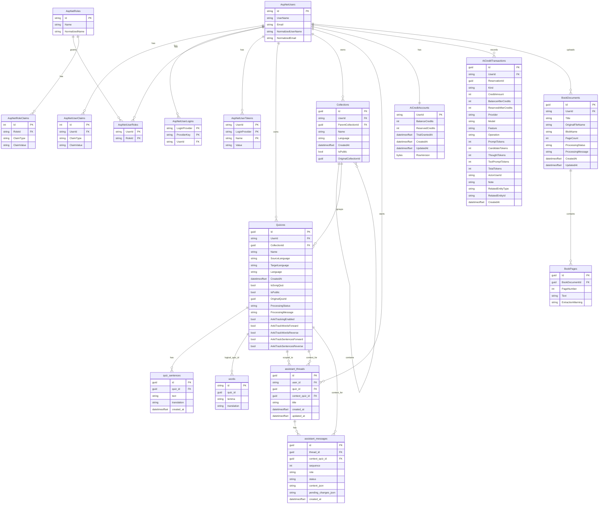

# Glosify Database Diagram

This diagram is based on `GlosifyContext` and the current EF Core model snapshot. ASP.NET Identity tables are simplified to their relationship-bearing columns.

## Notes

- `words.quiz_id` is used throughout the application as a quiz association, but the current EF Core model snapshot does not configure it as an enforced foreign key.
- `Collections.ParentCollectionId` is a self-reference with restricted delete behavior.
- `Quizzes.CollectionId`, `assistant_threads.quiz_id`, `assistant_threads.context_quiz_id`, and `assistant_messages.context_quiz_id` are nullable in the model.
- `BookPages` has a unique index on `(BookDocumentId, PageNumber)`.
- `assistant_messages` has a unique index on `(thread_id, sequence)`.
