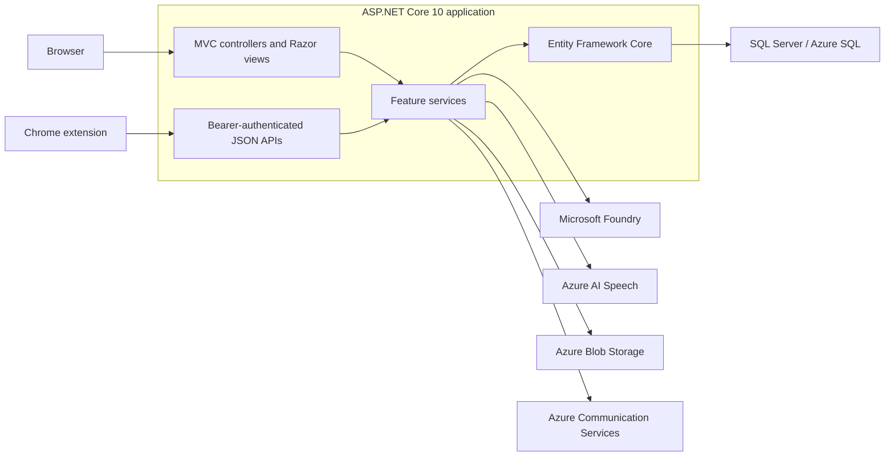

# Glosify portfolio case study

[Open the live application](https://glosify.se) · [Return to the repository README](../README.md)

Glosify is the full-stack project I use to learn how a complete .NET web
application fits together. It started as a school project and grew into a
deployed language-learning application with authentication, SQL persistence,
AI features, browser tests, and an Azure delivery pipeline.

## What the application does

Glosify brings several language-learning activities into one account:

- save vocabulary and sentences in quizzes and collections;
- practise with flashcards, typing exercises, and custom quizzes;
- upload PDF books, translate pages, and create learning material from them;
- practise conversations in animated speaking scenes;
- manage classrooms, assignments, chat, and calls;
- create and update quizzes through an assistant;
- translate audio from a Chrome tab with the Live Subtitles extension.

## Product tour

### Speaking practice

The speaking feature combines an animated scene, text or microphone input,
generated replies, optional translations, and structured scene actions. The
application owns and validates every action before changing the scene.

### Assistant-driven quiz creation

The assistant can propose changes to a user's learning library. Changes are
shown for review and remain application-owned: the user can apply or reject
them instead of letting the model write directly to the database.

### Practice modes

Vocabulary can be practised in both directions. Each practice session tracks
progress, while the saved quiz data remains in SQL Server.

### Books and context

PDF files are stored in Azure Blob Storage. Extracted page text is saved in the
database and can be translated, read aloud, or supplied to the assistant as
explicit context.

### Live translated subtitles

The Manifest V3 extension uses the same Glosify account and credit balance as
the website. It captures audio from the active tab and opens a short-lived,
authenticated WebSocket relay. Audio is relayed in memory and is not stored.
Saving an original-language transcript is a separate user choice.

## Architecture

Controllers deal with HTTP concerns such as routes, request validation, and
response types. Feature services own application behavior. EF Core is used
directly instead of hiding it behind a generic repository layer.

The application remains one web project. Splitting it into several projects
would add more ceremony without solving a current problem. Internal interfaces
are used where they create a useful test or responsibility boundary.

## Practices demonstrated in the repository

### ASP.NET Core

- MVC controllers and Razor views for the server-rendered website.
- Controller-based JSON APIs for mobile and extension clients.
- ASP.NET Core Identity with cookie and bearer authentication.
- A global antiforgery policy for unsafe MVC requests.
- Problem Details with stable error codes for API failures.
- Request validation, ownership checks, and named rate limits.
- Dependency injection and typed configuration options.
- Development OpenAPI output at `/openapi/v1.json`.

### Data and external services

- One clean `InitialCreate` migration for the current schema.
- SQL Server locally and Azure SQL in production.
- A reviewed EF migration bundle runs before application deployment.
- Blob compensation removes uploaded files when later persistence fails.
- Managed identity is used for supported Azure resources.
- Optional AI, speech, and storage providers stay outside readiness checks.

### Testing and delivery

The current automated suite contains:

- 595 .NET test cases, with four credential-gated Foundry tests skipped by
  default;
- 29 dependency-free JavaScript tests;
- four Playwright journeys covering accounts, quizzes, custom quizzes, and
  assistant chat management;
- a CI migration check that applies the schema to an empty SQL Server database
  and checks for pending model changes.

GitHub Actions publishes the application, builds the EF migration bundle, signs
in to Azure with OpenID Connect, applies migrations, and deploys to App Service.
CodeQL, secret scanning, push protection, Dependabot, and protected-branch
checks are enabled for the public repository.

## Deliberate limits

The portfolio deployment intentionally runs as one App Service instance. Some
session and coordination state remains in memory. That keeps this learning
project understandable and inexpensive, but it means active in-memory sessions
do not survive a restart and the app should not be scaled to multiple instances
without more work.

[ADR 0001](adr/0001-single-instance-state.md) records the current state and a
future Redis, SignalR backplane, and data-protection upgrade path.

## What I would improve next

- Replace older screenshots as the interface changes.
- Add accessibility checks to the browser suite.
- Split the largest remaining JavaScript files after behavior is covered.
- Add distributed state only if the deployment needs multiple instances.
- Continue moving expected application failures to typed domain outcomes.

The goal is not to make the project look artificially enterprise-sized. It is
to show that I can explain trade-offs, keep behavior tested, and improve a real
application without hiding its limitations.
