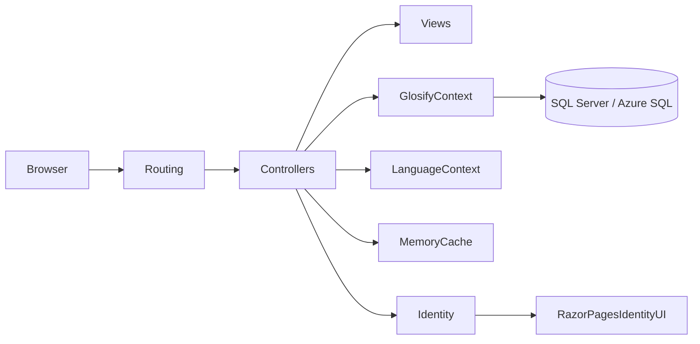
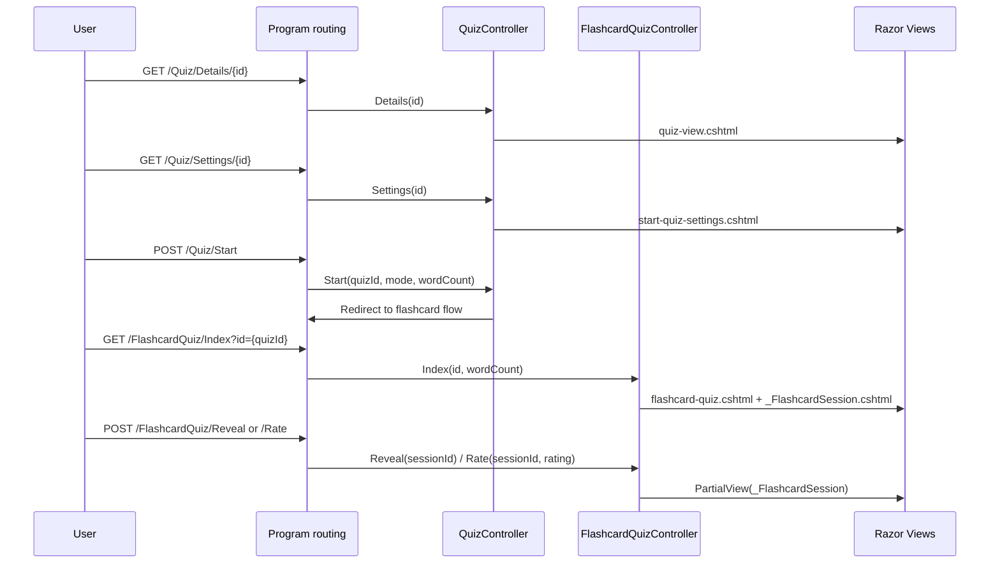

# ASP.NET Core MVC Compliance Review of gusbo9233/Glosify-.net

## Executive summary

Repository inspection was performed through the enabled entity["company","GitHub","software host"] connector only, and the external comparison standard was the official ASP.NET Core MVC guidance from entity["company","Microsoft","software company"] Learn documentation. Enabled connector(s): **GitHub**. On the evidence inspected, **gusbo9233/Glosify-.net is structurally recognisable as an ASP.NET Core MVC application**, with a `Program.cs` composition root, controller classes, Razor views, entity and view-model classes, an EF Core `DbContext`, Identity setup, static assets, and migrations. fileciteturn13file0L1-L1 fileciteturn47file0L1-L1 fileciteturn59file0L1-L1 fileciteturn60file0L1-L1 fileciteturn44file0L1-L1 citeturn2view0turn10view4turn11view1

The main weakness is **responsibility leakage out of services/domain logic and into controllers**. The official MVC guidance says controllers are a UI-level abstraction that should validate request data, choose a result, and delegate business concerns to services or the domain model. In this repo, `QuizController` visibly combines EF Core access, AI orchestration, JSON parsing, string processing, and dictionary matching, while `WordDetailsController` combines EF Core access, language-specific rules, ranking logic, Unicode normalisation, and raw SQL generation. That is the clearest gap between the project and Microsoft’s intended MVC pattern. fileciteturn40file0L1-L1 fileciteturn46file0L1-L1 citeturn2view0turn10view4turn8view0turn8view1

There are also **two important correctness/security concerns**. First, the project mixes ASP.NET Core Identity’s default `string` user key with a `Guid` `Quiz.UserId`, then compares values using `ToString()`, which is brittle and weakens relational integrity. Second, `WordDetailsController` checks quiz ownership in `Index`, `Details`, and `UpdatePartOfSpeech`, but the fetched `Edit` and `Delete` actions do **not** perform the same ownership check, which creates an insecure direct object reference risk for authenticated users. fileciteturn54file0L1-L1 fileciteturn48file0L1-L1 fileciteturn89file0L1-L1 fileciteturn45file0L1-L1 fileciteturn46file0L1-L1

My overall judgement is therefore: **good baseline MVC structure, moderate alignment with Microsoft’s pattern, but materially below best practice in controller composition, model design consistency, and some security boundaries**. The project does many framework things correctly; it is not “anti-MVC”. But it is currently closer to **“MVC-shaped code with fat controllers”** than to the cleaner separation implied by the Microsoft docs. fileciteturn13file0L1-L1 fileciteturn40file0L1-L1 fileciteturn46file0L1-L1 citeturn2view0turn10view4turn11view1

## Scope and repository structure

The inspected repository is organised as an app project (`Glosify`) plus a test project (`Glosify.Tests`), which is a sensible overall solution split for an MVC application. Confirmed app artefacts include a composition root in `Glosify/Program.cs`, controllers under `Glosify/Controllers`, models under `Glosify/Models`, a `GlosifyContext` under `Glosify/Data`, Razor views under `Glosify/Views`, static assets under `Glosify/wwwroot`, language state logic under `Glosify/Services`, additional AI-related code under `Glosify/ai-service`, and EF Core migrations under `Glosify/Migrations`. Confirmed test artefacts include `NavigationTests`, `DictionaryProbeTests`, and `EstonianQuizWordDetailTests` under `Glosify.Tests`. fileciteturn13file0L1-L1 fileciteturn37file0L1-L1 fileciteturn37file1L1-L1 fileciteturn37file2L1-L1 fileciteturn37file3L1-L1 fileciteturn37file4L1-L1 fileciteturn38file0L1-L1 fileciteturn38file6L1-L1 fileciteturn47file0L1-L1 fileciteturn58file0L1-L1 fileciteturn93file0L1-L1 fileciteturn44file0L1-L1 fileciteturn85file0L1-L1 fileciteturn86file0L1-L1 fileciteturn87file0L1-L1

### Actual layout compared with Microsoft-style MVC expectations

| MVC concern | Confirmed repo layout | Microsoft-style expectation | Assessment |
|---|---|---|---|
| Program / Startup | `Glosify/Program.cs` is present; no `Startup.cs` was surfaced in inspection. fileciteturn13file0L1-L1 | Modern ASP.NET Core commonly uses `Program.cs`; older apps may use `Startup`. Services are typically registered in `Program` or `Startup.ConfigureServices`. citeturn8view10turn3view0 | **Aligned**. Minimal hosting is current practice. |
| Controllers | `HomeController`, `AccountController`, `LoginController`, `LanguagesController`, `QuizController`, `FlashcardQuizController`, `WordDetailsController`. fileciteturn37file0L1-L1 fileciteturn37file1L1-L1 fileciteturn37file2L1-L1 fileciteturn37file3L1-L1 fileciteturn37file4L1-L1 fileciteturn38file0L1-L1 fileciteturn38file6L1-L1 | Controllers usually live in a root `Controllers` folder and follow `*Controller` naming. citeturn10view4 | **Aligned structurally**, but see controller-responsibility concerns below. |
| Models | Domain classes (`Quiz`, `Word`, `WordDetail`, `DictionaryEntry`, `ApplicationUser`) and view-model-style classes (`LoginViewModel`, `RegisterViewModel`, `WordDetailViewModel`, `QuizWorkspaceViewModel`, `FlashcardQuizViewModel`) all live under `Models`. fileciteturn48file0L1-L1 fileciteturn49file0L1-L1 fileciteturn50file0L1-L1 fileciteturn51file0L1-L1 fileciteturn54file0L1-L1 fileciteturn52file0L1-L1 fileciteturn53file0L1-L1 fileciteturn57file0L1-L1 fileciteturn56file0L1-L1 | MVC encourages models plus strongly typed view models, but does not mandate one foldering style. citeturn2view0turn8view5 | **Functionally aligned**, though a dedicated `ViewModels` folder would improve clarity. |
| Views | `Views/Account`, `Views/Home`, `Views/Languages`, `Views/Login`, `Views/Quiz`, `Views/Shared`, `Views/WordDetails`, plus `_ViewImports.cshtml` and `_ViewStart.cshtml`. fileciteturn69file0L1-L1 fileciteturn77file0L1-L1 fileciteturn73file0L1-L1 fileciteturn78file0L1-L1 fileciteturn64file0L1-L1 fileciteturn61file0L1-L1 fileciteturn74file0L1-L1 fileciteturn59file0L1-L1 fileciteturn60file0L1-L1 | Views usually live under `Views/[ControllerName]` with shared artefacts in `Views/Shared`. citeturn11view1turn11view3 | **Mostly aligned**. The extra `Views/Login` area looks like duplicate/stale UI. |
| wwwroot | Confirmed `wwwroot/css/site.css` and `wwwroot/js/site.js`. fileciteturn70file1L1-L1 fileciteturn31file0L1-L1 | Static assets typically live under `wwwroot`. citeturn12view3turn12view4 | **Aligned**. |
| Services | `Services/LanguageContext.cs` plus AI code under `ai-service/` rather than under `Services/`. fileciteturn58file0L1-L1 fileciteturn93file0L1-L1 fileciteturn95file0L1-L1 | Cross-cutting/business services are commonly placed in dedicated service/application layers and injected into controllers. citeturn8view1turn8view10 | **Partially aligned**. There is a service layer, but important application logic still sits in controllers. |
| Data | `Data/GlosifyContext.cs`. fileciteturn47file0L1-L1 | `DbContext` in a data layer is a common and recommended arrangement. citeturn7view0 | **Aligned**. |
| Migrations | Confirmed migration files include `CreateIdentitySchema`, `AddQuizTable`, `FixQuizzesTable`, `AddDictionaryEntries`, `AddWordsAndWordDetails`. fileciteturn44file1L1-L1 fileciteturn44file0L1-L1 fileciteturn44file4L1-L1 fileciteturn44file2L1-L1 fileciteturn44file3L1-L1 | EF Core migrations usually live in a `Migrations` folder and should be reviewed and checked into source control. citeturn5search0turn5search1 | **Aligned**, though one migration contains a destructive table drop. |

At a high level, the inspected application currently looks like this. The diagram is derived from the fetched repository artefacts and routing/composition setup. fileciteturn13file0L1-L1 fileciteturn47file0L1-L1 fileciteturn58file0L1-L1



## Controllers

From a naming and framework-convention point of view, the controller layer looks correct. Microsoft’s controller guidance says controllers normally live in the root `Controllers` folder, inherit from `Controller`, and expose public action methods. The inspected repository follows that pattern with recognisable MVC controller names and typical action signatures returning `IActionResult` or `Task<IActionResult>`. fileciteturn37file0L1-L1 fileciteturn37file1L1-L1 fileciteturn37file3L1-L1 fileciteturn37file4L1-L1 fileciteturn45file0L1-L1 fileciteturn46file0L1-L1 citeturn10view4

Routing also largely fits normal MVC practice. `Program.cs` configures conventional controller routing with `{controller=Home}/{action=Index}/{id?}`, and the fetched controllers then add verb attributes such as `[HttpGet]` and `[HttpPost]` where needed. That is a reasonable combination of conventional routing plus verb metadata. I did not inspect evidence of substantial `[Route(...)]`-based attribute routing beyond those HTTP method attributes. fileciteturn13file0L1-L1 fileciteturn45file0L1-L1 fileciteturn46file0L1-L1 fileciteturn40file0L1-L1 citeturn2view0turn8view13

Async usage is mostly good. Database-backed actions in `QuizController`, `FlashcardQuizController`, and `WordDetailsController` use `Task<IActionResult>` with async EF Core methods, while cache-only operations such as flashcard reveal/rate remain synchronous, which is reasonable. This is consistent with typical ASP.NET Core MVC practice, where async is especially valuable around I/O and not mandatory for pure in-memory work. fileciteturn40file0L1-L1 fileciteturn45file0L1-L1 fileciteturn46file0L1-L1 citeturn10view4

The bigger issue is **separation of concerns**. Microsoft’s guidance is explicit: controllers are a UI-level abstraction, should validate input and choose the result, and should not directly contain data access or business logic in well-factored apps. `FlashcardQuizController` is comparatively disciplined, but `QuizController` is visibly much heavier, directly referencing EF Core, `Google.GenAI`, JSON serialisation, regex/text processing, language context, and a large amount of orchestration code. `WordDetailsController` is similarly heavy: it contains language-configuration lookup, candidate selection heuristics, Unicode-normalisation helpers, raw SQL construction, and ranking logic. That code belongs in one or more injected application/domain services. fileciteturn40file0L1-L1 fileciteturn45file0L1-L1 fileciteturn46file0L1-L1 citeturn8view0turn8view1turn10view4

Model binding and validation are **mixed in quality**. There is proper use of dedicated view models with data annotations for sign-in and registration, and `WordDetailsController` uses `[Bind(...)]` plus `ModelState.IsValid` for create/edit forms. However, many of the core quiz actions bind primitive parameters directly from forms (`quizId`, `word`, `translation`, `sessionId`, `rating`, `wordCount`) and rely on manual string checks or no obvious validation beyond null/empty checks. A repository-wide search for `[Required]` surfaced only the login and register view models, not quiz input models, which strongly suggests uneven validation coverage. fileciteturn52file0L1-L1 fileciteturn53file0L1-L1 fileciteturn46file0L1-L1 fileciteturn45file0L1-L1 fileciteturn40file0L1-L1 fileciteturn81file0L1-L1 fileciteturn81file1L1-L1 citeturn8view3turn8view4

One additional design smell is the coexistence of a bespoke `Account` flow and a separate `LoginController` / `Views/Login/Index.cshtml` flow. The current `Account/Login` and `Account/Register` views are strongly typed and post back to `AccountController`, but `Views/Login/Index.cshtml` is a different UI that submits a GET request to `Home/Index`, and `NavigationTests` are written around `/Login` and `/Quizzes` route shapes. That indicates either stale prototype code, parallel UI surfaces, or route drift. None of those are good for a clean MVC surface area. fileciteturn69file0L1-L1 fileciteturn71file0L1-L1 fileciteturn78file0L1-L1 fileciteturn85file0L1-L1

For HTML-rendering MVC controllers, the project’s predominant use of `IActionResult` / `Task<IActionResult>` is entirely appropriate. I did not see a strong current need for `ActionResult<T>` because the inspected surface is mostly page/partial rendering rather than a typed JSON API. If the project later exposes more API-style JSON endpoints, `ActionResult<T>` would become more compelling there. fileciteturn45file0L1-L1 fileciteturn46file0L1-L1 fileciteturn67file0L1-L1 citeturn10view4

## Models, data, and EF Core

The data layer has a sound baseline shape. `GlosifyContext` lives in `Data`, derives from `IdentityDbContext<ApplicationUser>`, exposes `DbSet`s for the main aggregates, and uses `OnModelCreating` for key/index configuration. `Program.cs` registers the context with SQL Server through `AddDbContext`, which matches Microsoft’s recommended request-scoped DbContext usage in ASP.NET Core web apps. fileciteturn47file0L1-L1 fileciteturn13file0L1-L1 citeturn7view0

The repository also shows a sensible distinction between persistence/domain classes and UI-facing models. `Quiz`, `Word`, `WordDetail`, `DictionaryEntry`, and `ApplicationUser` act as persisted entities, while `LoginViewModel`, `RegisterViewModel`, `WordDetailViewModel`, `QuizWorkspaceViewModel`, and `FlashcardQuizViewModel` support strongly typed views. That is very much in the spirit of the MVC docs, which explicitly call out view-model types for strongly typed views. fileciteturn48file0L1-L1 fileciteturn49file0L1-L1 fileciteturn50file0L1-L1 fileciteturn51file0L1-L1 fileciteturn52file0L1-L1 fileciteturn53file0L1-L1 fileciteturn56file0L1-L1 fileciteturn57file0L1-L1 citeturn2view0turn8view5

The **largest model-design problem** is user identity typing. `ApplicationUser` inherits from `IdentityUser`, which uses a `string` key by default, but `Quiz.UserId` is a `Guid`, and the corresponding migration stores `UserId` as `uniqueidentifier`. The controllers then compensate by reading the claim as a string and comparing `q.UserId.ToString()` with that string. This is not a clean domain model. It weakens type safety, complicates ownership checks, and makes relational modelling harder than it needs to be. A cleaner design would either use a string FK to match default Identity, or intentionally switch the Identity stack to a `Guid` key end-to-end. fileciteturn54file0L1-L1 fileciteturn48file0L1-L1 fileciteturn89file0L1-L1 fileciteturn45file0L1-L1 fileciteturn46file0L1-L1

Validation metadata is also uneven. `LoginViewModel` and `RegisterViewModel` use `[Required]`, `[EmailAddress]`, `[MinLength]`, `[Compare]`, and password data types, which is strong and aligned with MVC validation guidance. By contrast, the main entity classes mostly carry database-mapping attributes such as `[Table]` and `[Column]`, but little or no validation metadata. That means `ModelState.IsValid` is much more valuable on the account forms than on many of the app’s core quiz/data inputs. fileciteturn52file0L1-L1 fileciteturn53file0L1-L1 fileciteturn49file0L1-L1 fileciteturn50file0L1-L1 fileciteturn51file0L1-L1 citeturn2view0turn8view4

Migrations are present and broadly in the expected place, which is good. However, one migration deserves special attention: `AddQuizTable` begins by dropping `dbo.Quizzes` if it already exists before recreating it. EF Core documentation strongly recommends reviewing generated migrations, and this file is a strong example of why. In a production setting, that pattern is data-destructive unless it is part of a deliberate one-off reset. fileciteturn89file0L1-L1 citeturn5search0turn5search1

`WordDetailsController` also uses `FromSqlInterpolated` with a generated `FormattableString` for variant lookup. That is preferable to concatenating raw SQL strings because it preserves EF Core parameterisation semantics, but it is still logic that belongs outside the controller. Additionally, heavy query-shaping and heuristic selection logic would be easier to test if moved into a repository/query service or application service. fileciteturn46file0L1-L1 citeturn8view0turn8view1

## Views and Razor

The view layer is one of the stronger parts of the project. The repository uses a root `Views` folder with controller- or feature-specific subfolders and a `Views/Shared` folder, which is exactly the general organisation Microsoft documents for MVC controllers and views. `_ViewImports.cshtml` and `_ViewStart.cshtml` are present, which is also idiomatic Razor setup. fileciteturn59file0L1-L1 fileciteturn60file0L1-L1 fileciteturn61file0L1-L1 fileciteturn64file0L1-L1 fileciteturn69file0L1-L1 fileciteturn74file0L1-L1 citeturn11view1turn11view3

Strongly typed views are used extensively and appropriately. `select-quiz.cshtml` is typed to `IEnumerable<Quiz>`, `start-quiz-settings.cshtml` to `QuizSettingsViewModel`, `quiz-view.cshtml` to `QuizWorkspaceViewModel`, `flashcard-quiz.cshtml` and `_FlashcardSession.cshtml` to `FlashcardQuizViewModel`, `Account/Login.cshtml` to `LoginViewModel`, `Account/Register.cshtml` to `RegisterViewModel`, and `WordDetails/Details.cshtml` to `WordDetailViewModel`. This is a good match for the MVC guidance on passing view models to strongly typed views. fileciteturn64file0L1-L1 fileciteturn65file0L1-L1 fileciteturn66file0L1-L1 fileciteturn67file0L1-L1 fileciteturn68file0L1-L1 fileciteturn69file0L1-L1 fileciteturn71file0L1-L1 fileciteturn74file0L1-L1 citeturn2view0

Tag Helpers are enabled in `_ViewImports.cshtml` and then used heavily through `asp-controller`, `asp-action`, `asp-route-*`, and `asp-for` bindings throughout the Razor files. That is squarely aligned with modern ASP.NET Core MVC view practice. fileciteturn59file0L1-L1 fileciteturn64file0L1-L1 fileciteturn65file0L1-L1 fileciteturn69file0L1-L1 fileciteturn74file0L1-L1 citeturn2view0

Partial views are also used sensibly. `_FlashcardSession.cshtml` breaks the flashcard session UI into a reusable fragment updated over AJAX-style form posts, and `_Grammar.cshtml` factors word-class-specific rendering out of the main detail page. Microsoft recommends partials for reusable markup and view components when server-side logic gets more complex; this repo is using partials in the right general way. fileciteturn68file0L1-L1 fileciteturn75file0L1-L1 fileciteturn74file0L1-L1 citeturn8view8turn8view9

The view layer’s main problem is **layout inconsistency and probable legacy/stale artefacts**. `_ViewStart.cshtml` sets the default layout to `~/Views/Shared/_AppLayout.cshtml`. Yet `Views/Shared/_Layout.cshtml` and `Views/Quiz/_QuizLayout.cshtml` also exist, and the account/login-related views explicitly set `Layout = "~/Views/Shared/_GlosifyLayout.cshtml"`. A connector search surfaced references to `_GlosifyLayout.cshtml`, but not the layout file itself. That either means the file exists somewhere not surfaced by the connector inspection, or more likely that the views are referencing a stale/missing layout. Either way, it is an MVC maintainability problem. fileciteturn60file0L1-L1 fileciteturn61file0L1-L1 fileciteturn62file0L1-L1 fileciteturn63file0L1-L1 fileciteturn69file0L1-L1 fileciteturn71file0L1-L1 fileciteturn72file0L1-L1 fileciteturn70file0L1-L1 fileciteturn70file2L1-L1 fileciteturn70file4L1-L1 citeturn8view7

The project also uses explicit view paths in places where ordinary view discovery would have sufficed. Microsoft’s view discovery conventions are robust and make controller/view relationships clearer. Absolute paths such as `~/Views/Quiz/flashcard-quiz.cshtml` are valid, but overuse couples controller code directly to file paths and makes later refactoring harder. fileciteturn45file0L1-L1 fileciteturn67file0L1-L1 citeturn11view3

Finally, `_AppLayout.cshtml` is visually sophisticated but carries a fair amount of helper logic around route-state calculation and navigation rendering. That is still within acceptable view territory, but if the navigation grows more dynamic, a view component would be a cleaner long-term fit because Microsoft explicitly positions view components for reusable UI that needs server-side code. fileciteturn61file0L1-L1 citeturn2view0turn8view9

A representative current request flow looks like this. The diagram is derived from `Program.cs`, quiz views, and flashcard controller/view interactions. fileciteturn13file0L1-L1 fileciteturn65file0L1-L1 fileciteturn67file0L1-L1 fileciteturn68file0L1-L1 fileciteturn45file0L1-L1



## Application plumbing and security

The application composition root is mostly solid. `Program.cs` registers the DbContext, Identity, Google authentication when credentials are present, `IHttpContextAccessor`, a scoped `ILanguageContext`, memory cache, MVC controllers with views, and Razor Pages. The middleware/order is also broadly sensible: exception handling and HSTS outside development, then HTTPS redirection, static assets, routing, authentication, authorisation, default controller route, and Razor Pages. That is recognisably the standard ASP.NET Core MVC setup. fileciteturn13file0L1-L1 citeturn8view10turn8view11turn8view12turn8view13

Static file handling is modern: the app uses `MapStaticAssets` and serves front-end assets from `wwwroot`, including `site.css` and `site.js`. That aligns with current ASP.NET Core guidance. However, the legacy `_Layout.cshtml` references Bootstrap and jQuery assets under `~/lib/...`, and those assets were not surfaced in the inspected files. Since `_ViewStart` points to `_AppLayout.cshtml`, that risk may currently be limited to stale/unused layout paths, but it is still a sign of mixed generations of UI assets. As Microsoft notes, static files under web root are public by default when static-file handling runs before authorisation. fileciteturn13file0L1-L1 fileciteturn31file0L1-L1 fileciteturn62file0L1-L1 citeturn12view3turn12view4turn12view2

Configuration usage is partly strong and partly improvised. Strongly aligned parts include reading the DB connection and auth secrets through `builder.Configuration`, using environment variables for conditional Google auth configuration, and a deployment document that points to Azure App Service settings and connection-string configuration. That follows the normal ASP.NET Core configuration model, where later providers such as environment variables override earlier file-based settings. fileciteturn13file0L1-L1 fileciteturn23file0L1-L1 citeturn13view0

The improvised part is `GeminiCaller`, which manually reads a `.env` file from a relative path, sets process environment variables itself, and then pulls `GEMINI_API_KEY` from process state. That is not how ASP.NET Core normally wants configuration and secrets to flow. Official Microsoft guidance is to avoid storing secrets in source or config files and to use the built-in configuration pipeline, Secret Manager / user secrets for development, and a controlled external store in production. If `GeminiCaller` is no longer used, it should be removed; if it is used, it should be rewritten around options binding and injected configuration. fileciteturn93file0L1-L1 fileciteturn23file0L1-L1 citeturn14search1turn14search2turn13view0

Logging is present but thin. `Program.cs` creates a scope, applies pending migrations, and logs any migration failure using the built-in logger. That is good hygiene. But from the fetched core application files, I did not confirm widespread `ILogger<T>` usage elsewhere, so operational observability appears limited outside startup. Microsoft’s defaults already give Console/Debug/EventSource providers, but the application code itself could log more meaningful domain events and failures. fileciteturn13file0L1-L1 citeturn9view2turn8view16

Security is mixed, and this is one of the most important sections of the review. On the positive side, the app uses ASP.NET Core Identity, conditionally supports Google external login, maps Razor Pages for Identity UI, and applies `[Authorize]` broadly to `LanguagesController`, `QuizController`, `FlashcardQuizController`, and `WordDetailsController`. It also includes anti-forgery tokens in forms and uses `[ValidateAntiForgeryToken]` on many POST actions. `CookieLanguageContext` is also carefully written, restricting values to an allowed list and setting `HttpOnly`, `SameSite`, `IsEssential`, and `Secure` (when HTTPS). fileciteturn13file0L1-L1 fileciteturn84file0L1-L1 fileciteturn84file1L1-L1 fileciteturn84file2L1-L1 fileciteturn84file3L1-L1 fileciteturn83file0L1-L1 fileciteturn83file1L1-L1 fileciteturn83file2L1-L1 fileciteturn83file3L1-L1 fileciteturn83file4L1-L1 fileciteturn58file0L1-L1 citeturn9view7turn9view8turn9view5


The second gap is **non-uniform validation**. Microsoft’s MVC docs emphasise model-bound validation and `ModelState.IsValid`. The repo uses that pattern in some places, but quiz/session inputs are often bound as loose primitives with ad hoc checks. This is not automatically unsafe, but it is weaker than using dedicated request models with annotations and central validation. fileciteturn40file0L1-L1 fileciteturn45file0L1-L1 fileciteturn52file0L1-L1 fileciteturn53file0L1-L1 citeturn8view3turn8view4

The third gap is **antiforgery policy consistency**. The repo is doing many individual `[ValidateAntiForgeryToken]` applications correctly. However, Microsoft explicitly notes that `ValidateAntiForgeryToken` also covers GET when used directly, and recommends `AutoValidateAntiforgeryToken` when you want automatic coverage of unsafe methods only. In a project with many form posts across views and partials, a global unsafe-method antiforgery policy is usually cleaner and harder to forget. fileciteturn83file0L1-L1 fileciteturn83file1L1-L1 fileciteturn83file2L1-L1 fileciteturn83file3L1-L1 fileciteturn83file4L1-L1 citeturn9view4

## Tests

The project does have a real test project, which is a meaningful strength. `NavigationTests` use `WebApplicationFactory<Program>` and HTML parsing for route and DOM assertions. `DictionaryProbeTests` and `EstonianQuizWordDetailTests` exercise real data flows with `GlosifyContext`, controller calls, and dictionary enrichment behaviour. This means the repository is not ignoring testability altogether. fileciteturn85file0L1-L1 fileciteturn86file0L1-L1 fileciteturn87file0L1-L1 citeturn8view20turn3view9

That said, the tests are **more integration-heavy than architecture-protective**. Microsoft’s testing guidance makes `WebApplicationFactory` a standard tool for integration tests, and the repo uses it correctly, but there is far less evidence of narrow unit tests around the logic that most needs isolation: dictionary ranking, word extraction/orchestration, authorisation helpers, and other controller-extracted application rules. Given how much logic currently lives in controllers, that matters. fileciteturn85file0L1-L1 fileciteturn86file0L1-L1 fileciteturn87file0L1-L1 citeturn2view0turn3view9

Some of the current tests also appear to be drifting away from the inspected application surface. `NavigationTests` expect `/Quizzes`, `/Login`, `/Quizzes/Flashcard`, `/Quizzes/Type`, and even a login form that submits to Home with `method='get'`. By contrast, the current typed account views post to `AccountController`, the main quiz views are under `Views/Quiz`, and the default route pattern in `Program.cs` is the standard controller/action route. That mismatch strongly suggests stale tests, stale UI, or both. fileciteturn85file0L1-L1 fileciteturn13file0L1-L1 fileciteturn64file0L1-L1 fileciteturn65file0L1-L1 fileciteturn69file0L1-L1 fileciteturn78file0L1-L1

A final concern is environmental dependence. `DictionaryProbeTests` and `EstonianQuizWordDetailTests` read `DefaultConnection` and run against an actual SQL Server-backed database. That can be useful for high-value integration coverage, but it also means the test suite is less isolated and potentially harder to run repeatably in CI unless its environment is carefully provisioned. fileciteturn86file0L1-L1 fileciteturn87file0L1-L1 citeturn3view9

## Recommendations and maintainer checklist

The highest-priority improvement is to **move application logic out of controllers**. Concretely, `QuizController` should depend on a small application service such as `IQuizApplicationService`, and `WordDetailsController` should depend on a `IWordDetailsService` plus perhaps a dedicated `IDictionaryLookupService`. Controllers should collect route/form data, validate it, call a service, and translate outputs into `View(...)`, `RedirectToAction(...)`, or partial-view results. That is the single change that would make the repository look much more like Microsoft’s intended MVC layering. fileciteturn40file0L1-L1 fileciteturn46file0L1-L1 citeturn8view0turn8view1turn10view4

A practical sketch looks like this:

```csharp
public sealed class AddWordInput
{
    [Required]
    public Guid QuizId { get; init; }

    [Required, StringLength(120)]
    public string Word { get; init; } = string.Empty;

    [Required, StringLength(120)]
    public string Translation { get; init; } = string.Empty;
}

public interface IQuizApplicationService
{
    Task AddWordAsync(string userId, AddWordInput input, CancellationToken ct);
}

public sealed class QuizController : Controller
{
    private readonly IQuizApplicationService _quizs;

    public QuizController(IQuizApplicationService quizs) => _quizs = quizs;

    [HttpPost]
    public async Task<IActionResult> AddWord(AddWordInput input, CancellationToken ct)
    {
        if (!ModelState.IsValid)
            return BadRequest(ModelState);

        var userId = User.FindFirstValue(ClaimTypes.NameIdentifier)!;
        await _quizs.AddWordAsync(userId, input, ct);
        return RedirectToAction(nameof(Details), new { id = input.QuizId });
    }
}
```

The next priority is to **fix authorisation on `WordDetailsController` edit/delete endpoints** and centralise ownership checks. At the moment the controller proves it already knows how to do ownership-aware queries, but it does not use that discipline consistently. The simplest safe rule is: every route that loads a `WordDetail` for edit/delete must load it through an ownership-constrained query. fileciteturn46file0L1-L1

A safe pattern would look like this:

```csharp
private async Task<WordDetail?> FindOwnedWordDetailAsync(string userId, string id)
{
    return await _context.WordDetails
        .Join(
            _context.Quizzes.Where(q => q.UserId.ToString() == userId),
            detail => detail.QuizId,
            quiz => quiz.Id,
            (detail, _) => detail)
        .FirstOrDefaultAsync(detail => detail.Id == id);
}

public async Task<IActionResult> Edit(string? id)
{
    if (string.IsNullOrWhiteSpace(id)) return NotFound();

    var userId = User.FindFirstValue(ClaimTypes.NameIdentifier);
    if (string.IsNullOrEmpty(userId)) return RedirectToAction("Login", "Account");

    var wordDetail = await FindOwnedWordDetailAsync(userId, id);
    if (wordDetail is null) return NotFound();

    return View(wordDetail);
}
```

The third priority is to **fix the Identity key mismatch**. Either make the domain’s user FK a `string` to match default Identity, or intentionally change Identity to use GUID keys across the board. As it stands, the code is compensating for a modelling inconsistency instead of solving it. Also add real foreign-key/navigation relationships so EF Core can model ownership more explicitly. fileciteturn54file0L1-L1 fileciteturn48file0L1-L1 fileciteturn89file0L1-L1

The fourth priority is to **standardise validation and antiforgery policy**. Introduce dedicated request models for quiz/session posts, annotate them, and add a global unsafe-method antiforgery filter so individual actions do not need to remember it. The MVC docs specifically recommend `AutoValidateAntiforgeryToken` for the common “unsafe HTTP methods only” case. citeturn8view4turn9view4

A clean registration pattern is:

```csharp
builder.Services.AddControllersWithViews(options =>
{
    options.Filters.Add(new AutoValidateAntiforgeryTokenAttribute());
});
```

The fifth priority is to **rationalise the UI surface**. Remove or consolidate `LoginController` vs `AccountController`, decide on one canonical layout stack, resolve or remove references to `_GlosifyLayout.cshtml`, and delete unused template leftovers such as `_Layout.cshtml` / `_QuizLayout.cshtml` if they are no longer part of the active UI. Prefer ordinary view discovery over hard-coded view paths where possible. fileciteturn60file0L1-L1 fileciteturn61file0L1-L1 fileciteturn62file0L1-L1 fileciteturn63file0L1-L1 fileciteturn69file0L1-L1 fileciteturn71file0L1-L1 fileciteturn72file0L1-L1 fileciteturn78file0L1-L1 citeturn11view3turn8view7

The sixth priority is to **bring AI/configuration code into the standard ASP.NET Core configuration/options model**. Replace manual `.env` loading with an injected options object and normal configuration binding, and use Secret Manager / user secrets for development rather than a custom file reader. fileciteturn93file0L1-L1 citeturn14search1turn14search2turn13view0

For example:

```csharp
public sealed class GeminiOptions
{
    public string ApiKey { get; init; } = string.Empty;
    public string Model { get; init; } = "gemini-2.5-flash-lite";
}

builder.Services.Configure<GeminiOptions>(
    builder.Configuration.GetSection("Gemini"));
```

The seventh priority is to **rebalance the test suite**. Keep `WebApplicationFactory` integration tests, but add unit tests around extracted services, use a dedicated test database strategy, and update navigation/auth tests so they reflect the current route/view model instead of prototype paths. fileciteturn85file0L1-L1 fileciteturn86file0L1-L1 fileciteturn87file0L1-L1 citeturn3view9

### Maintainer checklist

- [ ] Extract AI, dictionary lookup, ranking, and text-processing logic out of `QuizController`.
- [ ] Extract word-detail lookup/variant SQL and language heuristics out of `WordDetailsController`.
- [ ] Add ownership checks to all `WordDetails` edit/delete endpoints.
- [ ] Unify user-key types between Identity and domain entities.
- [ ] Introduce request/view models for quiz/session POST actions and annotate them.
- [ ] Add global `AutoValidateAntiforgeryToken`.
- [ ] Consolidate layouts and remove stale `Login`/prototype UI paths.
- [ ] Replace `.env` loading with options binding + ASP.NET Core configuration.
- [ ] Review destructive migrations, especially `AddQuizTable`.
- [ ] Update tests to the current routing and add unit tests around extracted services.

### Referenced primary documentation

- **Overview of ASP.NET Core MVC** citeturn2view0  
- **Handle requests with controllers in ASP.NET Core MVC** citeturn10view4  
- **Model Binding in ASP.NET Core** citeturn8view3turn8view2  
- **Model validation in ASP.NET Core MVC** citeturn8view4  
- **Views in ASP.NET Core MVC** citeturn11view1turn11view3  
- **Layout in ASP.NET Core** citeturn8view7  
- **Partial views in ASP.NET Core** citeturn8view8  
- **View components in ASP.NET Core** citeturn8view9  
- **Dependency injection in ASP.NET Core** citeturn8view10  
- **ASP.NET Core Middleware** citeturn8view11turn8view12  
- **Routing in ASP.NET Core** citeturn8view13  
- **Static files in ASP.NET Core** citeturn12view3turn12view4turn12view2  
- **Configuration in ASP.NET Core** citeturn13view0  
- **Logging in .NET and ASP.NET Core** citeturn9view2  
- **Prevent Cross-Site Request Forgery attacks in ASP.NET Core** citeturn9view4turn9view5  
- **Introduction to Identity on ASP.NET Core** citeturn9view6turn9view7  
- **Simple authorization in ASP.NET Core** citeturn9view8  
- **Integration tests in ASP.NET Core** citeturn8view20turn3view9  
- **EF Core DbContext lifetime, configuration, and initialization** citeturn7view0  
- **EF Core migrations guidance** citeturn5search0turn5search1  
- **Safe storage of app secrets in development in ASP.NET Core** citeturn14search1turn14search2  

### Open questions and limitations

This review is based on the files surfaced through the GitHub connector and the specific files fetched during inspection. A few large files, especially `QuizController.cs`, were partially truncated in connector output, so the report focuses on high-confidence findings visible in the retrieved content. Likewise, some “absence” observations, such as no confirmed `Areas` usage or no surfaced `_GlosifyLayout.cshtml` file, should be read as **“not identified in the inspected artefacts”** rather than absolute proof that no such artefact exists anywhere in the repository.